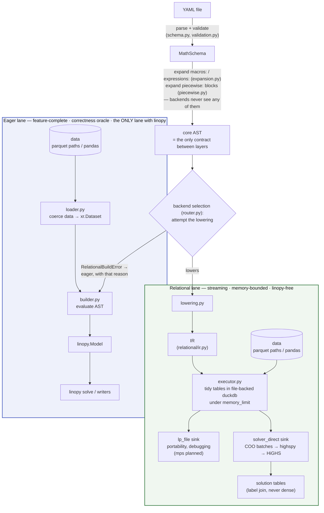
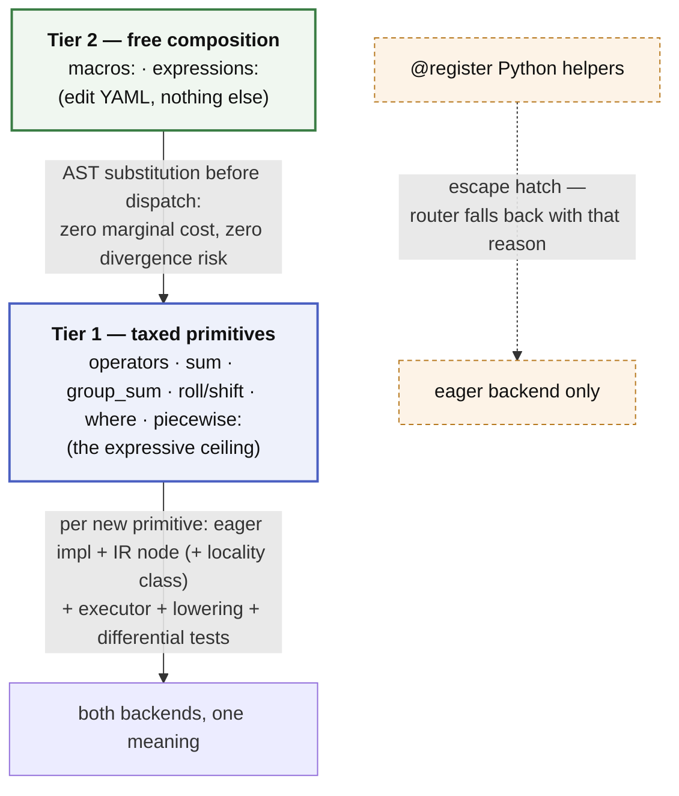

# Architecture

Brief, current, precise. If a PR changes the structure described here, it
updates this file in the same PR. Details live in [SPEC.md](SPEC.md);
measured results live in `scratch/relational_spike/README.md`.

## Thesis

A YAML math spec is a **closed AST known before any data is touched**. That
one property makes everything else legal: the whole model can be compiled —
to eager xarray/linopy calls, or to a logical plan executed relationally
under a fixed memory budget — with both paths provably meaning the same
thing. Every architectural rule below exists to protect that property.

## Pipeline

Eligibility is decided by *attempting the lowering*, so it can never drift
from what the backend actually supports.

## Hard rules

1. **Core AST is the whole language.** Both backends consume only core AST.
   Anything above it (named expressions, macros) is expanded away before
   dispatch; anything below it (IR, SQL, xarray) is backend-private.
2. **The relational lane is linopy-free.** `linopy_yaml/relational/` imports
   neither the eager builder nor linopy itself — the lane goes duckdb →
   highspy → solver with linopy's semantics as a spec to match, not code to
   share. Engine-internal naming encodes neither "duckdb" nor "yaml".
3. **The eager builder is the correctness oracle and the fallback.** The
   relational backend is an optimization lane: eligibility is decided by
   *attempting the lowering*, and anything outside the subset routes eager
   with a stated reason. Differential tests (same YAML + data through both
   backends, matching solves) guard every language feature on both.
4. **The full model never resides in this process's memory** on the
   relational path — not as dense arrays, not as a full CSR. Build under a
   duckdb `memory_limit`, hand off in batches, read back by label join. The
   solver's internal copy is the only irreducible full-model residency.
5. **Backend-visible YAML files are self-contained.** No Python-side state
   (registries, session objects) may change what a YAML file means.

## The two-tier language

The language is a deliberate economy of **taxed primitives** and **free
composition**:

- **Primitives** (operators, `sum`, `group_sum`, `roll`/`shift`, `where` predicates)
  set the expressive ceiling. Each new primitive costs the full two-backend
  tax: eager implementation, IR node, executor implementation, lowering
  case, differential tests, SPEC entry.
- **Macros and named expressions** (`macros:` / `expressions:` blocks in the
  YAML) are pure AST substitution — every composition of primitives, at zero
  marginal cost and zero divergence risk, because neither backend ever sees
  them.

Policy that keeps the economy healthy:

- For any feature request, first ask: **macro or primitive?** Most requests
  are compositions. Only a genuinely new shape (aggregation, coupling)
  earns a primitive.
- **New primitives must be macro-friendly**: anything a user might
  parameterise goes in a *value* position (like `over=`/`into=`), never in
  a kwarg key (the `roll`/`shift` `(x, snapshot=1)` dim-as-key design is
  the counterexample — macros cannot parameterise the dimension).
- **New primitives declare coordinate locality** for the relational
  executor: *pointwise* (joins, masks, group_sum) and *bounded-halo*
  (roll/shift: t±k) compose under partition-wise execution; *global* operators
  (running sums, normalisations) are rejected at lowering with a rewrite
  hint (e.g. running sum → state-variable recurrence).

Deliberately impossible, at every tier: conditionals, iteration, or any
data-dependent structure inside expressions. The declarative substitutes
are `where` masks and `foreach` dims; computation belongs in data prep,
producing a parameter. `@register` Python helpers remain as an explicitly
**eager-only** escape hatch.

## Module map

| Module | Role |
|---|---|
| `_patch.py`, `accessor.py` | entry point: `Model.from_yaml()` / `.yaml` accessor |
| `schema.py` | pydantic schema incl. `expressions:` / `macros:` / `piecewise:` blocks |
| `expression_parser.py`, `where_parser.py` | text → core AST |
| `expansion.py` | named-expression / macro substitution (pre-dispatch) |
| `validation.py` | load-time: parse, expand, name-check everything |
| `piecewise.py` | `piecewise:` → λ-formulation declarations (schema-level expansion) + data-time curvature guard |
| `router.py` | backend selection: relational iff the schema lowers, else eager with the verbatim reason |
| `loader.py` | eager lane: data coercion to xr.Dataset, master coords |
| `builder.py` | eager backend: core AST → linopy.Model |
| `lowering.py` | core AST → IR (defines the relational subset) |
| `relational/ir.py` | frozen logical-plan dataclasses |
| `relational/executor.py` | duckdb execution + lp_file / solver_direct sinks |
| `helpers.py` | built-in + `@register` helpers (eager evaluation) |

## Extension checklists

**Add a macro / named expression:** edit YAML. Nothing else.

**Add a primitive:** grammar (usually free — `f(x, k=v)` already parses) →
eager helper → IR node (+ locality class) → executor → lowering case →
differential test on both sinks → SPEC §5/§7 + this file if structural.
