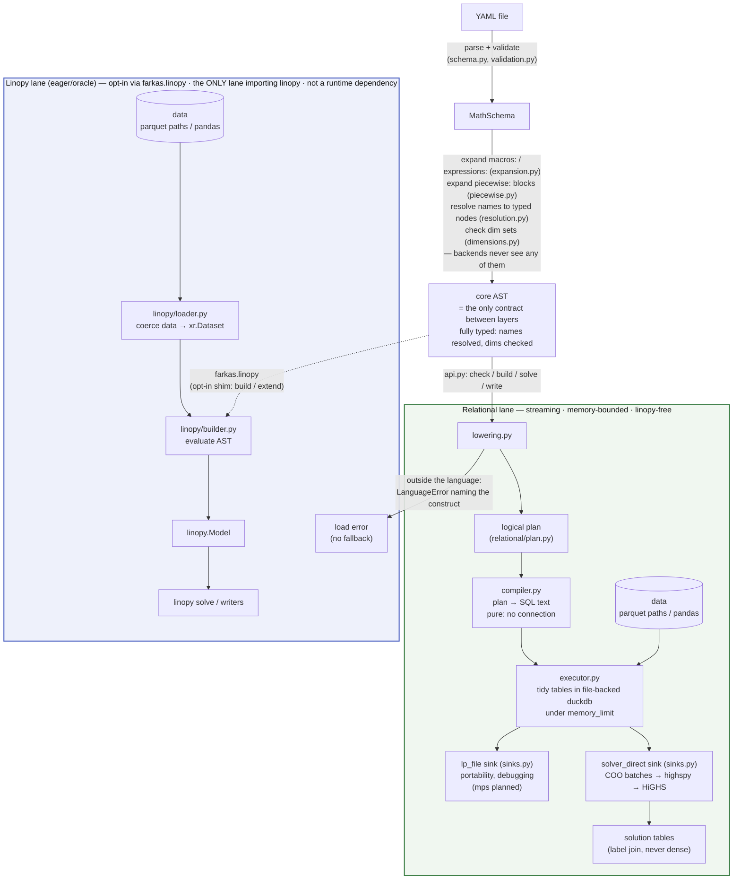

# Architecture

Brief, current, precise. A PR that changes the structure described here updates
this file in the same PR. The language is [SPEC.md](SPEC.md); plans and refusals
are [ROADMAP.md](ROADMAP.md); measured results are
[docs/benchmarks.md](docs/benchmarks.md).

`python examples/walkthrough.py` executes the pipeline below stage by stage
and prints what each one produces — the same public calls `fk.solve` makes,
so the demonstration cannot drift from the code. Its output is committed as
[examples/walkthrough.out](examples/walkthrough.out) and asserted line for line
(`tests/test_walkthrough.py`), so reading it is the same as running it — and a
stage that starts telling a different story shows up as a diff in that file.

## Thesis

A YAML math spec is a **closed AST known before any data is touched**. That one
property makes everything else legal: the whole model can be compiled — to eager
xarray/linopy calls, or to a logical plan executed relationally under a fixed
memory budget — with both paths provably meaning the same thing. Every rule
below protects it.

Eligibility is decided by **attempting the lowering** — `lower_program` returns
a `Program` or raises `fk.LanguageError` — so it cannot drift from what the
engine supports. Errors split model from run: everything under `LanguageError`
is decidable without data, `DataError` is what a source failed to supply, and
both are `LinopyYamlError` (`errors.py`). `fk.check()` is exactly parse
→ expand → validate → lower with no data bound, so a model repository can
compile-check its math in CI. Expansion precedes validation in **both** lanes,
because a formulation emits declarations and those are language too — a stray
dim in generated math is the same error as a stray dim in a written one.

## Hard rules

*Enforced, not aspirational: `tests/test_architecture.py` encodes these as
static checks and CI's bare-install job proves the dependency claims.*

0. **The layers are ordered, and imports prove it.** Every module imports only
   downward, at module level, with exactly one declared exception: `lowering.py`
   reaches `piecewise.py` lazily, because a formulation must expand *before*
   lowering while expanding needs the subset test lowering defines.
   `DELIBERATE_LAZY_IMPORTS` in `tests/test_architecture.py` is the whole list,
   and an undeclared in-function import fails the build — a lazy import is how
   the one real cycle is broken, so decorative ones cannot be allowed to hide
   it.
1. **Core AST is the whole language.** Both backends consume only core AST;
   macros, named expressions and `piecewise:` are expanded away before dispatch,
   and the plan/SQL/xarray are backend-private. The AST crossing that seam is **fully
   resolved** — names are typed `Variable`/`Parameter`/`Dimension` nodes — so a backend cannot
   hold its own opinion about what a name refers to. Resolving independently is
   how the two lanes silently disagreed about scoping before.
2. **The engine knows nothing about linopy, xarray or YAML.**
   `src/farkas/relational/` goes duckdb → highspy → solver, with linopy's
   semantics as a spec to match rather than code to share; it never sees the
   schema, the AST, or the eager builder. Engine-internal naming encodes
   neither "duckdb" nor "yaml". Enforced *more* strictly than stated — the
   engine imports nothing from the package at all, bar declared
   dependency-free leaves (`errors.py` today, listed in `ENGINE_MAY_IMPORT`)
   — because a near-zero import surface is what keeps the subpackage
   extractable. Widening that list is a decision, not an accident.
3. **One language, two lanes — not fast-vs-slow versions of each other.** The
   streaming engine builds models declared in YAML; the linopy lane attaches
   YAML math to a `linopy.Model` already in memory, which is structurally eager.
   **Both accept exactly the same language**, and no helper registry exists that
   could create a divergence — that equality is what makes the differential
   tests an oracle rather than a comparison of dialects. A construct outside the
   language is a load error naming the construct and its rewrite, never a
   redirection to the other lane.
4. **Peak memory is a function of the configured budget, not of model size.**
   That is the invariant; "nothing full-model in process" is the *mechanism*
   that delivers it at scale — build under a duckdb `memory_limit`, hand off in
   batches, read back by label join, never materialise dense arrays or a full
   CSR. Two residencies are exempt because neither scales with the budget's
   purpose: the solver's own model when solving in-process, and a model small
   enough that the budget exceeds it (the planned in-memory executor holds
   everything by design — ROADMAP Track 5). A new feature is judged against the
   invariant, not the mechanism: the question is whether peak still tracks the
   budget, not whether some array was briefly contiguous.
5. **Backend-visible YAML files are self-contained.** No Python-side state
   (registries, session objects) may change what a file means.
6. **The public interface is a declared model, not a Python API.** YAML is the
   format we ship and document; the contract underneath it is `MathSchema`, and
   whether that seam is ever blessed is open (see Composition). The Python
   surface is the runner (`api.py`); the plan is internal, and a stable
   plan-construction API is a later possibility, not a current contract.

## Two tiers, and the ceiling

**Primitives** (operators, `sum`, `group_sum`, `roll`/`shift`, `where`
predicates) set the expressive ceiling, and each costs the full two-backend tax:
eager implementation, plan node + locality class, executor case, lowering case,
differential tests, SPEC entry. **`macros:` / `expressions:`** are pure AST
substitution — every composition of primitives at zero marginal cost and zero
divergence risk. **Formulations** (`piecewise:`) are taxed like a primitive but
compose like a macro: they emit *new declarations* before dispatch and never
enter as plan expression nodes.

For any request, triage: **macro, primitive, or escape?** Most are compositions.
New primitives must be **macro-friendly** — anything a user might parameterise
goes in a *value* position like `over=`/`by=`, never a kwarg key; the
`roll(x, snapshot=1)` dim-as-key design is the language's own counterexample.

A candidate primitive is admissible iff it is all three of **degree 1 (affine)**
— `variable × parameter`, never `variable × variable`, the one axis that is a
scope choice rather than a consequence of streaming
([ROADMAP](ROADMAP.md#the-degree-axis)); **relational** — filter / join /
group-by-aggregate over tidy tables; and **local** — *pointwise* or
*bounded-halo*, which compose under partition-wise execution where *global*
operators do not. Locality is judged in **data space**: reductions over a
*coordinate* space ("the last snapshot") read only the small, already
materialised dim tables and stay admissible even though they look global.

**Read the verdict off the SQL.** Rules 2 and 3 are one question asked twice,
and the executor already answers it — write the candidate's SQL over the term
stream first:

| Shape of the emitted SQL | Locality | Rules 2–3 |
|---|---|---|
| filter on a column already in the frame | pointwise | admissible |
| equi-join against a parameter or mapping table | pointwise | admissible |
| join on `dim_d.ord ± k`, `k` fixed | bounded-halo | admissible |
| dim table only, no data join | coordinate-space | admissible (free) |
| window over unbounded rows, or a recursive CTE | global | **reject**, with the rewrite |

This is the case analysis `_sum_fragment`, `_group_fragment` and
`_translate_fragment` already implement — each rewriting one fragment on its
own, which is what *pointwise* and *bounded-halo* mean in code — so a candidate
fitting none of those shapes has no executor to be written into. Two limits: **degree is not a SQL property**, and it
presumes `GROUP BY row, col` stays the only aggregate a *term* passes through.
A primitive is finished when `lowering.py` accepts it and the differential test
against the linopy oracle passes.

What is *outside* the closure splits three ways, and the split decides whether a
request can ever be met:

| Tier | Bounded by | Members | Can it move? |
|---|---|---|---|
| **Capability-bounded** | what a given sink can ingest | SOS / indicator (#23); quadratic | per sink — see below |
| **Budget-bounded** | the escape *label* budget — a cap on emitted rows and columns, not `memory_limit` | global operators, arbitrary Python, non-relational manipulation | already movable — that is what an island is |
| **Design-bounded** | our choice of where work belongs | data prep, domain helpers, Python declaring structure | movable any time; we don't want to |

Impossible **in the symbolic plan**: conditionals, iteration, any data-dependent
structure inside expressions. What is protected here is *static* boundedness —
the plan must know every component's extent before data is touched — which is a
different property from rule 4's memory invariant, though the two meet at the
escape hatch. That is why an `escape:` island (#38) is admissible where a
registered Python helper was not: its extent is fixed by the preceding `where`
mask, it is terminal, and it is named in the file. Its **label budget is how it
satisfies rule 4** — the same "peak tracks a declared budget" bargain the rest
of the engine makes, denominated in labels rather than bytes, and enforced
before any Python runs rather than after it allocates.

An escape buys back the *relational* and *local* rules (it returns affine COO
rows — a running-sum island still emits affine rows, just O(T²) of them) but
never **degree**, because affine COO is what it returns. That refusal stands on
what an island *emits*, not on what a sink accepts, so it is unaffected by the
capability findings below.

### Capability is not the ceiling

The ceiling above is about **streamability** and is solver-independent. What a
*sink* can ingest is a separate axis, and conflating the two let one solver's
limits read as architectural law — "no sink carries the stream" described
HiGHS, not the architecture. Two findings, measured in
[docs/benchmarks.md](docs/benchmarks.md#sink-capabilities): SOS is
**solver-bounded** (HiGHS has no SOS concept at all, while `lp_file` carries it
as a text section and Gurobi natively), and what blocks quadratic is a
**conjunction** — HiGHS has integrality *and* a Hessian and refuses the pair —
so capability is not a flat set. The whole-Hessian handoff is an implementation
difference, not a rule-4 violation.

Making this a declared per-sink capability set, with `check` taking an optional
sink, is [ROADMAP Track 4](ROADMAP.md#track-4--sink-capabilities).

## The relational lane

**Three modules, one per box above.** `compiler.py` turns plan nodes into SQL
and holds no connection; `executor.py` owns the database and fills the tables;
`sinks.py` drains them. The split is what makes the admissibility test below
something you can perform rather than reason about — build a `SqlCompiler`,
hand it a node, read the `SELECT` (`tests/test_compiler.py` does exactly that,
with no engine installed). It is also why a new sink is a function in one file
instead of another method on the executor.

**Tidy tables.** Parameters are `(dims…, value)`; a variable frame is
`(dims…, var_label)`, one row per *existing* variable; a linear expression is
`(frame dims…, var_label, coeff)` plus a constant part; constraint rows are
`(row, sense, rhs)`; the coefficient matrix is COO `(row, col, coeff)`. Masks
are **row absence** — no NaN sentinels, no `-1` labels. Broadcasting is a join,
`sum` drops coordinate columns, `group_sum` joins the dim table and projects a
declared coordinate in place of the grouped dim. Neither aggregates: both
rewrite a fragment's dim tuple, and duplicates collapse in the terminal
`SUM(coeff) GROUP BY row, col` at assembly. Labels
are dense `0..n-1` by construction, so `var_label` **is** the solver column
index and `row` the solver row index — no remapping. That is also why value-only
re-solve is cheap and structural editing is out of scope.

**The plan is affine-by-design.** No node introduces variables or constraints as a
side effect of an expression; formulations are model *transformations*. Variable
*types* are not formulations — binary/integer are a `vtype` column, LP
`binary`/`general` sections and HiGHS integrality, which keeps basic MILP inside
the streaming lane. Reimplementing linopy's reformulation passes inside the plan
is explicitly rejected: that duplicates the library this package consumes.

**Chunk only what cannot spill.** duckdb's joins and plain numeric hash
aggregates spill under `memory_limit` on their own, so only label assignment and
the LP-text `string_agg` need hand-managed partitioning, and the database must
be file-backed. The measurements behind those rules — and the operators that
OOM instead of spilling — are in
[docs/benchmarks.md](docs/benchmarks.md#operational-findings).

**Sinks are capped, explicitly.** Today every sink expresses the same three
streams and no more: `cols` (bounds, objective coefficients, integrality),
`rows`, and `A` in COO. The upgrade path is two further streams — `sos_sets`
and `genconstr` — plus a semi-continuous threshold on `cols`. Unlike the three
that exist, those two would land *unevenly*, because the destinations differ
per sink (see "Capability is not the ceiling"); that unevenness is what
[Track 4](ROADMAP.md#track-4--sink-capabilities) exists to make declared rather
than discovered at solve time.

## Composition (component libraries)

A component library is a fixed set of parametrised templates agreeing on a
port/flow convention, merged into one program, wired through a data connectivity
table and a single `group_sum` balance. **Topology is data, not structure** —
wiring a specific system is rows in a connectivity table, never generated YAML,
so structure is bounded by the number of component *types* while cardinality
lives entirely in data. Schema merge is therefore a pure **compose-then-build**
step producing one `MathSchema` before a single lower/stream pass (`linopy.extend`
is a linopy-lane shim; native merge is #30). Namespacing via qualified names is
the missing primitive (#29) — the port/flow surface stays deliberately shared, as
the coupling contract between templates — and signs and bidirectional flows need
bounds-as-expressions (#31).

Whatever genuinely is not data (variable port counts, runtime-unknown component
types) belongs in a thin layer emitting **more rows or more templates, never
per-instance YAML** — but **that layer has nothing *supported* to call**. A seam
does exist: `api.load_schema` accepts `dict | MathSchema`, so a programmatically
built model already goes through validation, expansion, resolution and dim
checking. It is just undocumented and unversioned, while rule 6 refuses a Python
modeling API and this section forbids generated YAML. Composition therefore
forces that contract earlier than the roadmap has it: not a general modeling API,
but a narrow, versioned way to emit declarations. Should anything ever be
blessed, it is the schema level and not the plan level — that much is settled;
what is not is whether to bless the seam at all, and namespacing (#29) or a
native schema merge (#30) is what would force the question.

## Module map

| Module | Role |
|---|---|
| `schema.py` | pydantic schema incl. `expressions:` / `macros:` / `piecewise:` |
| `expression_parser.py`, `where_parser.py` | text → core AST; grammar only, dependency-free |
| `expansion.py` | named-expression / macro substitution (pre-dispatch) |
| `resolution.py` | one flat namespace; `NameNode` → typed `Variable`/`Parameter`/`Dimension` nodes |
| `dimensions.py` | static dim-set checking over the resolved AST |
| `validation.py` | load-time: parse, expand, resolve, check everything |
| `piecewise.py` | `piecewise:` → λ-formulation declarations + curvature guard |
| `api.py` | native entry point: `check` / `solve` / `write`, linopy-free |
| `sources.py` | bind runtime data (parquet paths / Arrow tables) to a validated schema |
| `lowering.py` | core AST → logical plan (defines the relational subset) |
| `helpers.py` | the closed set of built-in operators: their *names* and *call shapes* — no registry |
| `errors.py` | the exception hierarchy; the one module the engine may import |
| `relational/plan.py` | frozen logical-plan dataclasses |
| `relational/arrow.py` | the Arrow boundary — caller tables in, via the PyCapsule protocol |
| `relational/compiler.py` | plan → SQL text; pure, no connection |
| `relational/sql.py` | how a value is spelled in SQL — quoting for caller-supplied paths |
| `relational/status.py` | solve outcome on two axes; linopy's vocabulary, copied not imported |
| `relational/executor.py` | duckdb: bind sources, label, assemble the tables |
| `relational/sinks/` | how a built model leaves: `lp_file`, `solver_direct` (one module each, [README](src/farkas/relational/sinks/README.md)) |
| `linopy/__init__.py` | opt-in shim: `build` / `extend` on a `linopy.Model` |
| `linopy/loader.py` | data coercion to `xr.Dataset`, master coords |
| `linopy/builder.py` | eager backend: core AST → `linopy.Model` |

Two subpackages, and the directory *is* the rule in both cases. Everything
under `relational/` is the engine and imports nothing else from the package;
everything under `linopy/` is the opt-in eager lane and is the only code
allowed to import linopy or xarray. `tests/test_architecture.py` reads
membership off the path, so neither fence can be stepped over by naming a
file differently.

### Naming across the layers

The same construct passes through three layers, and each names it in full —
no abbreviations, so a name never has to be decoded. The **layer is the
suffix**, which is what keeps the three vocabularies from colliding:

| Layer | Suffix | Example |
|---|---|---|
| YAML block (`schema.py`) | `Block` | `VariableBlock`, `PiecewiseBlock` |
| Core AST (`*_parser.py`) | `Node` | `VariableNode`, `DimensionComparisonNode` |
| Logical plan (`relational/plan.py`) | none / `Declaration` | `Variable`, `VariableDeclaration` |

Two rules follow from that table, and a PR that adds a construct keeps them:

- **A node names the coordinate map, not a surface spelling.** `roll` and
  `shift` are one node, so it is `Translate` — naming it `Shift` would make
  one of the two spellings look privileged.
- **Nothing is abbreviated.** `Cmp` became `ParameterComparison`, `vtype`
  became `variable_type`. The one place abbreviation survives is SQL column
  names inside the executor, which are not Python identifiers.

### Where a concept is already linopy's, use linopy's name

For anything this package shares with linopy — solve statuses, result shapes,
solver metrics, duals — adopt **linopy's primitive**: its spelling, its field
names, its decomposition. `Result` is the envelope (status + solution +
report) and `Solution` the raw arrays, because that is what those words mean
in linopy; `status` / `termination_condition` are two axes and `is_ok` is the
rollup, because that is linopy's model. Our audience arrives from
linopy/PyPSA, and a second vocabulary for one fact is a tax on every one of
them. It also keeps the oracle honest: the two lanes can be compared exactly
rather than through case-folding.

**Copy it; do not import it.** The engine may not import linopy (rule 2), so
the tables live here — and a test imports linopy and asserts the copy still
matches (`tests/test_solve_status.py`). A copy nobody checks is a copy that
rots, and the failure should be a red test rather than a user handed two
dialects.

This applies to vocabulary we *share*. Where the design genuinely differs it
stays ours: we have no `Solution` of dense arrays to hold, because the values
live in duckdb and are read by label join.

## Extension checklists

**Add a macro or named expression:** edit YAML. Nothing else.

**Add a primitive:** grammar (usually free — `f(x, k=v)` already parses) →
signature in `helpers.BUILTINS` (arity and which arguments name dimensions —
resolution, validation and lowering all read it from there, so the shape is
declared once) → eager helper → plan node + locality class → executor →
lowering case → differential test on both sinks → SPEC §5/§7, and this file if
structural.

Two things are deliberately *not* per-primitive work, because they are one
implementation each: a primitive's dim rule lives only in `dimensions.py` —
both its dim *set* and its verdict on an operand that lacks the dim being
reduced along, which lowering asks for rather than deciding again — and the
dense-label assignment that gives a coordinate its solver index lives only in
`DuckdbExecutor._label_frame`, shared by variables and constraint rows. What a
lowering case still owns is what is about the plan: which node the call becomes,
and the shapes that node cannot represent.
