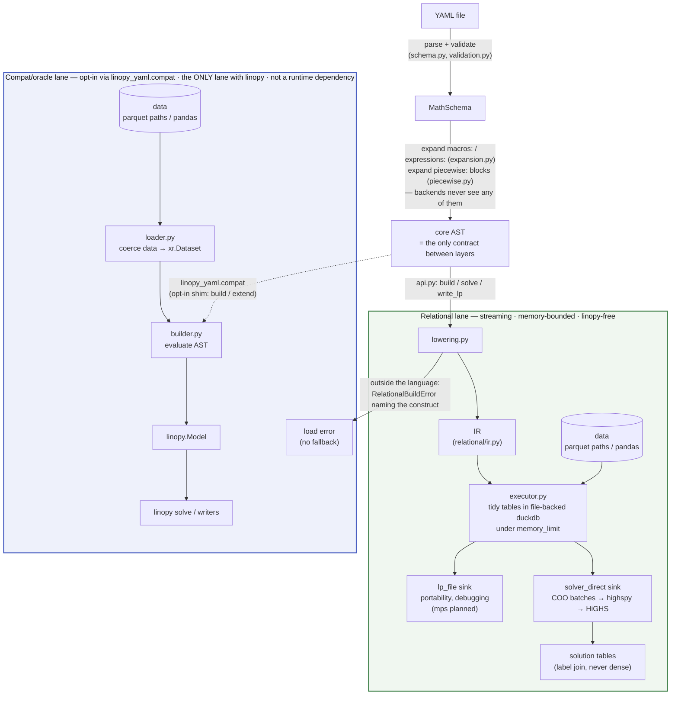
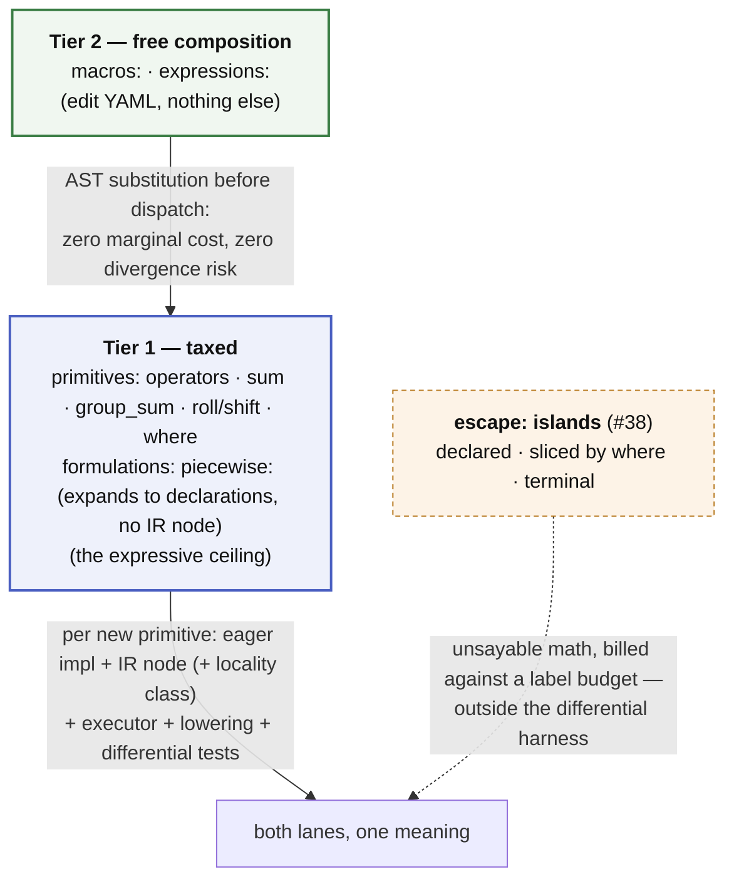

# Architecture

Brief, current, precise. If a PR changes the structure described here, it
updates this file in the same PR. Details live in [SPEC.md](SPEC.md); the
per-construct vocabulary lives in [GLOSSARY.md](GLOSSARY.md); what is planned
and what is refused lives in [ROADMAP.md](ROADMAP.md); measured results live
in `scratch/relational_spike/README.md`.

## Thesis

A YAML math spec is a **closed AST known before any data is touched**. That
one property makes everything else legal: the whole model can be compiled —
to eager xarray/linopy calls, or to a logical plan executed relationally
under a fixed memory budget — with both paths provably meaning the same
thing. Every architectural rule below exists to protect that property.

## Pipeline

Eligibility is decided by *attempting the lowering*, so it can never drift
from what the backend actually supports.

## Hard rules

*(Enforced, not aspirational: `tests/test_architecture.py` encodes these rules
as static checks, and CI's bare-install job proves the dependency claims.)*

1. **Core AST is the whole language.** Both backends consume only core AST.
   Anything above it (named expressions, macros) is expanded away before
   dispatch; anything below it (IR, SQL, xarray) is backend-private.
2. **The relational lane is linopy-free.** `linopy_yaml/relational/` imports
   neither the eager builder nor linopy itself — the lane goes duckdb →
   highspy → solver with linopy's semantics as a spec to match, not code to
   share. Engine-internal naming encodes neither "duckdb" nor "yaml".
3. **One language, two lanes — and the lanes are not fast-vs-slow versions
   of each other.** The streaming engine builds models declared in YAML;
   the compat lane (`linopy_yaml.compat`: `build` / `extend`, `[compat]`
   extra) attaches YAML math to a `linopy.Model` that already lives in
   memory, which is structurally eager — the base model is dense before we arrive, so
   streaming its extension would buy nothing. **Both lanes accept exactly
   the same language**: there is no construct that works on one and not the
   other, and no Python helper registry that could create one. That
   equality is what makes the differential tests (same YAML + data through
   both, matching solves) an oracle rather than a comparison of dialects.
   A construct outside the language is a load error naming the construct
   and its rewrite — never a redirection to the other lane.
4. **The full model never resides in this process's memory** on the
   relational path — not as dense arrays, not as a full CSR. Build under a
   duckdb `memory_limit`, hand off in batches, read back by label join. The
   solver's internal copy is the only irreducible full-model residency.
5. **Backend-visible YAML files are self-contained.** No Python-side state
   (registries, session objects) may change what a YAML file means.
6. **The public interface is YAML, full stop.** Python surface is limited to
   the runner (`api.py`: bind sources, build, solve, write) — there is no
   Python modeling API. The IR is internal; a stable IR-construction API is
   a possible later addition, not a current contract.

## The two-tier language

The language is a deliberate economy of **taxed primitives** and **free
composition**:

- **Primitives** (operators, `sum`, `group_sum`, `roll`/`shift`, `where` predicates)
  set the expressive ceiling. Each new primitive costs the full two-backend
  tax: eager implementation, IR node, executor implementation, lowering
  case, differential tests, SPEC entry.
- **Macros and named expressions** (`macros:` / `expressions:` blocks in the
  YAML) are pure AST substitution — every composition of primitives, at zero
  marginal cost and zero divergence risk, because neither backend ever sees
  them.

Policy that keeps the economy healthy:

- For any feature request, first ask: **macro, primitive, or escape?** Most
  requests are compositions (macro, free). Only a genuinely new shape
  (aggregation, coupling) earns a primitive, and only if it clears the
  ceiling below. Math that is not sayable at all goes to a declared
  `escape:` island rather than into the language.
- **New primitives must be macro-friendly**: anything a user might
  parameterise goes in a *value* position (like `over=`/`into=`), never in
  a kwarg key (the `roll`/`shift` `(x, snapshot=1)` dim-as-key design is
  the counterexample — macros cannot parameterise the dimension).
- **New primitives declare coordinate locality** for the relational
  executor: *pointwise* (joins, masks, group_sum) and *bounded-halo*
  (roll/shift: t±k) compose under partition-wise execution; *global* operators
  (running sums, normalisations) are rejected at lowering with a rewrite
  hint (e.g. running sum → state-variable recurrence).

Impossible **in the symbolic plan**: conditionals, iteration, or any
data-dependent structure inside expressions. The declarative substitutes are
`where` masks and `foreach` dims; computation belongs in data prep, producing
a parameter. The invariant being protected is *boundedness*, not purity — the
plan must know every component's extent before data is touched. That is why
an `escape:` island (#38) is admissible where a registered Python helper was
not: its footprint is fixed by the `where` mask that precedes it, it is
terminal (yields a constraint, never a sub-expression), and it is named in
the file. There is no Python helper registry — the built-in set is closed, so
both lanes accept the same language.

## The expressive ceiling

The tax above says what a primitive *costs*. This says which primitives are
*admissible at all* — the ceiling is a closure, not a wish list, and it is
what we specify against instead of another tool's feature set.

A candidate primitive is admissible iff it is all three of:

1. **degree 1 (affine)** — `variable × parameter`, never `variable × variable`.
   Pinned by decision (SPEC §12.4), not by principle: this is the one axis of
   the three that is a *scope choice* rather than a consequence of streaming.
   Its rationale, its substitutes, and the conditions that would move it to
   degree 2 are recorded in [ROADMAP.md](ROADMAP.md#the-degree-axis);
2. **relational** — expressible as filter / join / group-by-aggregate over
   tidy tables;
3. **local** — *pointwise* (joins, masks, `group_sum`) or *bounded-halo*
   (`roll`/`shift`: t±k). Both compose under partition-wise execution.
   *Global* operators (running sums, normalisations) do not, and are
   rejected at lowering with a rewrite hint.

Locality is judged in **data space**. Reductions over a *coordinate* space —
"the last snapshot", "the index at position −24" — read only the dim tables,
which are small and already materialised, so they are free and stay
admissible even though they look global.

The done-condition follows from the rules rather than from taste: a
primitive is finished when `lowering.py` accepts it and the differential
test against the linopy oracle passes. Two consequences worth stating
plainly:

- **Other languages are a lower bound, not the target.** Calliope's math
  language and PyPSA's hand-written constraint modules are corpora we score
  coverage against (#27); they are not specifications to match. Anything of
  theirs outside this closure is out of scope by construction, and this
  closure admits operators none of them expose.
- **Every rejection is a product statement.** A construct outside the
  closure is a load error naming the construct and its rewrite, or a
  declared `escape:` island (#38) — never a silent fallback, and never a
  redirection to the other lane (hard rule 3).

What is *outside* the closure then splits three ways, and the distinction
decides whether a request can ever be met:

| Tier | Bounded by | Members | Can it move? |
|---|---|---|---|
| **Sink-bounded** | what the sinks ingest — vtypes, affine rows, COO (§12.6) | degree ≥ 2; SOS / indicator (#23) | only by adding a stream to *every* sink |
| **Budget-bounded** | the escape label budget | global operators, arbitrary Python, non-relational manipulation | already movable — that is what an island is |
| **Design-bounded** | our choice of where work belongs | data prep, domain helpers, Python declaring structure | movable any time; we don't want to |

An escape returns affine COO rows, so it buys back the *relational* and
*local* rules — a running-sum island still emits affine rows, just O(T²) of
them, which is exactly what the budget is for. It cannot buy back **degree**,
and it cannot buy back SOS: no sink carries those streams. Sink-bounded is
the real ceiling; everything else is priced or chosen.

Two cautions. Billing trades *verified* for *unverified* — islands sit
outside the differential harness by construction, so the rewrite (recurrence
over running-sum island) stays the recommended answer even where the island
is legal. And escapes stay **terminal**: letting one return a composable
expression would leak an unbounded footprint back into the plan and dissolve
the boundedness argument that admits them at all.

The ordered primitive list, corpus scoring plan, and the deliberate
non-primitives with their rewrites live in [ROADMAP.md](ROADMAP.md).

## Composition (component libraries)

A component library is a fixed set of parametrised templates agreeing on a
port/flow convention, merged into one program, wired through a data
connectivity table and a single `group_sum` balance. The governing principle:

**Topology is data, not structure.** Wiring a specific system is rows in a
connectivity table, never generated YAML. A well-designed library has
structure bounded by the number of component *types* and cardinality entirely
in data — exactly the shape the streaming engine wants (`foreach` → GROUP BY,
connectivity table → JOIN, balance → aggregate). The library boundary and
the streaming backend are one discipline, not two.

Rules that follow:

- **Compose-then-build.** Schema merge is a pure step producing one
  `MathSchema` before a single lower/stream pass — never incremental build
  per template (`compat.extend` is a compat-lane shim; native merge: #30).
- **Namespacing** (qualified names on import) is the missing primitive: #29.
  The port/flow surface (`flow`, connectivity dims) is deliberately shared,
  not namespaced — it is the coupling contract between templates.
- Signs and bidirectional flows need bounds-as-expressions: #31.
- Whatever genuinely is not data (variable port counts, runtime-unknown
  component types) lives in a thin programmatic layer that emits **more rows
  or more templates — never per-instance YAML**. Keep that residue small and
  streaming stays intact.

## Module map

| Module | Role |
|---|---|
| `schema.py` | pydantic schema incl. `expressions:` / `macros:` / `piecewise:` blocks |
| `expression_parser.py`, `where_parser.py` | text → core AST |
| `expansion.py` | named-expression / macro substitution (pre-dispatch) |
| `validation.py` | load-time: parse, expand, name-check everything |
| `piecewise.py` | `piecewise:` → λ-formulation declarations (schema-level expansion) + data-time curvature guard |
| `api.py` | native entry point: `check` / `build` / `solve` / `write`, linopy-free |
| `compat.py` | opt-in shim: `build` / `extend` on a `linopy.Model` (`[compat]` extra) — pure producers, nothing attached |
| `loader.py` | compat/oracle lane: data coercion to xr.Dataset, master coords |
| `builder.py` | eager backend: core AST → linopy.Model, incl. eager helper evaluation |
| `lowering.py` | core AST → IR (defines the relational subset) |
| `relational/ir.py` | frozen logical-plan dataclasses |
| `relational/executor.py` | duckdb execution + lp_file / solver_direct sinks |
| `helpers.py` | the closed set of built-in helper *names* — no registry; dependency-free, so the linopy-free lane can import it |

## Extension checklists

**Add a macro / named expression:** edit YAML. Nothing else.

**Add a primitive:** grammar (usually free — `f(x, k=v)` already parses) →
eager helper → IR node (+ locality class) → executor → lowering case →
differential test on both sinks → SPEC §5/§7 + this file if structural.
