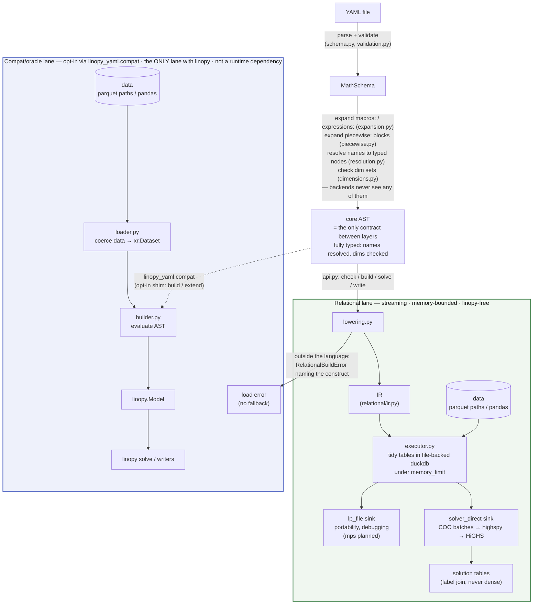

# Architecture

Brief, current, precise. A PR that changes the structure described here updates
this file in the same PR. The language is [SPEC.md](SPEC.md); plans and refusals
are [ROADMAP.md](ROADMAP.md); measured results are
[docs/benchmarks.md](docs/benchmarks.md).

## Thesis

A YAML math spec is a **closed AST known before any data is touched**. That one
property makes everything else legal: the whole model can be compiled — to eager
xarray/linopy calls, or to a logical plan executed relationally under a fixed
memory budget — with both paths provably meaning the same thing. Every rule
below protects it.

Eligibility is decided by **attempting the lowering** — `lower_program` returns
a `Program` or raises `RelationalBuildError` (public alias `ly.LanguageError`) —
so it cannot drift from what the engine supports. `ly.check()` is exactly parse
→ validate → expand → lower with no data bound, so a model repository can
compile-check its math in CI.

## Hard rules

*Enforced, not aspirational: `tests/test_architecture.py` encodes these as
static checks and CI's bare-install job proves the dependency claims.*

1. **Core AST is the whole language.** Both backends consume only core AST;
   macros, named expressions and `piecewise:` are expanded away before dispatch,
   and IR/SQL/xarray are backend-private. The AST crossing that seam is **fully
   resolved** — names are typed `Var`/`Param`/`Dim` nodes — so a backend cannot
   hold its own opinion about what a name refers to. Resolving independently is
   how the two lanes silently disagreed about scoping before.
2. **The relational lane is linopy-free.** `linopy_yaml/relational/` imports
   neither the eager builder nor linopy: duckdb → highspy → solver, with
   linopy's semantics as a spec to match rather than code to share.
   Engine-internal naming encodes neither "duckdb" nor "yaml".
3. **One language, two lanes — not fast-vs-slow versions of each other.** The
   streaming engine builds models declared in YAML; the compat lane attaches
   YAML math to a `linopy.Model` already in memory, which is structurally eager.
   **Both accept exactly the same language**, and no helper registry exists that
   could create a divergence — that equality is what makes the differential
   tests an oracle rather than a comparison of dialects. A construct outside the
   language is a load error naming the construct and its rewrite, never a
   redirection to the other lane.
4. **The full model never resides in this process's memory** on the relational
   path — not as dense arrays, not as a full CSR. Build under a duckdb
   `memory_limit`, hand off in batches, read back by label join. The solver's
   internal copy is the only irreducible full-model residency.
5. **Backend-visible YAML files are self-contained.** No Python-side state
   (registries, session objects) may change what a file means.
6. **The public interface is YAML.** The Python surface is the runner (`api.py`).
   The IR is internal; a stable IR-construction API is a possible later addition,
   not a current contract.

## Two tiers, and the ceiling

**Primitives** (operators, `sum`, `group_sum`, `roll`/`shift`, `where`
predicates) set the expressive ceiling, and each costs the full two-backend tax:
eager implementation, IR node + locality class, executor case, lowering case,
differential tests, SPEC entry. **`macros:` / `expressions:`** are pure AST
substitution — every composition of primitives at zero marginal cost and zero
divergence risk. **Formulations** (`piecewise:`) are taxed like a primitive but
compose like a macro: they emit *new declarations* before dispatch and never
enter as IR expression nodes.

For any request, triage: **macro, primitive, or escape?** Most are compositions.
New primitives must be **macro-friendly** — anything a user might parameterise
goes in a *value* position like `over=`/`into=`, never a kwarg key; the
`roll(x, snapshot=1)` dim-as-key design is the language's own counterexample.

A candidate primitive is admissible iff it is all three of **degree 1 (affine)**
— `variable × parameter`, never `variable × variable`, the one axis that is a
scope choice rather than a consequence of streaming
([ROADMAP](ROADMAP.md#the-degree-axis)); **relational** — filter / join /
group-by-aggregate over tidy tables; and **local** — *pointwise* or
*bounded-halo*, which compose under partition-wise execution where *global*
operators do not. Locality is judged in **data space**: reductions over a
*coordinate* space ("the last snapshot") read only the small, already
materialised dim tables and stay admissible even though they look global.

**Read the verdict off the SQL.** Rules 2 and 3 are one question asked twice,
and the executor already answers it — write the candidate's SQL over the term
stream first:

| Shape of the emitted SQL | Locality | Rules 2–3 |
|---|---|---|
| filter on a column already in the frame | pointwise | admissible |
| equi-join against a parameter or mapping table | pointwise | admissible |
| join on `dim_d.ord ± k`, `k` fixed | bounded-halo | admissible |
| dim table only, no data join | coordinate-space | admissible (free) |
| window over unbounded rows, or a recursive CTE | global | **reject**, with the rewrite |

This is the case analysis `_sum_piece`, `_group_piece` and `_shift_piece`
already implement, so a candidate fitting none of those shapes has no executor
to be written into. Two limits: **degree is not a SQL property**, and it
presumes `GROUP BY row, col` stays the only aggregate a *term* passes through.
A primitive is finished when `lowering.py` accepts it and the differential test
against the linopy oracle passes.

What is *outside* the closure splits three ways, and the split decides whether a
request can ever be met:

| Tier | Bounded by | Members | Can it move? |
|---|---|---|---|
| **Capability-bounded** | what a given sink can ingest | SOS / indicator (#23); quadratic | per sink — see below |
| **Budget-bounded** | the escape label budget | global operators, arbitrary Python, non-relational manipulation | already movable — that is what an island is |
| **Design-bounded** | our choice of where work belongs | data prep, domain helpers, Python declaring structure | movable any time; we don't want to |

Impossible **in the symbolic plan**: conditionals, iteration, any data-dependent
structure inside expressions. The invariant is *boundedness*, not purity — the
plan must know every component's extent before data is touched. That is why an
`escape:` island (#38) is admissible where a registered Python helper was not:
its footprint is fixed by the preceding `where` mask, it is terminal, and it is
named in the file. An escape buys back the *relational* and *local* rules (it
returns affine COO rows — a running-sum island still emits affine rows, just
O(T²) of them) but never **degree**, because affine COO is what it returns.

### Capability is not the ceiling

The ceiling above is about **streamability** and is solver-independent. What a
*sink* can ingest is a separate axis, and conflating the two let one solver's
limits read as architectural law. Measured, not assumed:

| | `lp_file` | HiGHS direct | Gurobi direct |
|---|---|---|---|
| affine rows, COO, integrality | text | native | native |
| semi-continuous | text | `kSemiContinuous` | native |
| SOS1 / SOS2 | text section | **no concept** — `HighsLp` has no SOS field | `addSOS` |
| indicator | text section | **no concept** | `addGenConstrIndicator` |
| quadratic objective | text section | `passHessian` — but **`Hessian + integrality` errors**, so no MIQP | native, incl. MIQP |

Two consequences the old "no sink carries the stream" framing hid. SOS is
**solver-bounded, not architecture-bounded** — it is one `COPY` from a
`sos_sets` table on `lp_file`, and native on Gurobi. And quadratic is the
*harder* one, not the easier one: both direct APIs take the Hessian whole
(`passHessian`, `setMObjective`), with no incremental counterpart to pair with
batched `addCols`/`addRows` — so it is hard rule 4, not capability, that blocks
it. Capability is also not a flat set: HiGHS has integrality *and* a Hessian
and still refuses their conjunction.

Making this an explicit, declared per-sink capability set — with `check` taking
an optional sink — is [ROADMAP Track 4](ROADMAP.md#track-4--sink-capabilities).

**The oracle has a ceiling too, and it is linopy's.** The differential harness
can only validate constructs linopy can also build, while the closure admits
operators linopy does not expose. The compat lane is a product feature justified
by models already in memory (rule 3), not by the harness, and must not grow
eager implementations whose only consumer is a test; a primitive admissible here
but awkward in linopy is verified against a hand-checked fixture. If it can only
be verified by writing linopy code we would not otherwise ship, that is evidence
to reconsider the primitive.

## The relational lane

**Tidy tables.** Parameters are `(dims…, value)`; a variable frame is
`(dims…, var_label)`, one row per *existing* variable; a linear expression is
`(frame dims…, var_label, coeff)` plus a constant part; constraint rows are
`(row, sense, rhs)`; the coefficient matrix is COO `(row, col, coeff)`. Masks
are **row absence** — no NaN sentinels, no `-1` labels. Broadcasting is a join,
`sum` drops coordinate columns, `group_sum` joins a mapping parameter. Labels
are dense `0..n-1` by construction, so `var_label` **is** the solver column
index and `row` the solver row index — no remapping. That is also why value-only
re-solve is cheap and structural editing is out of scope.

**The IR is affine-by-design.** No node introduces variables or constraints as a
side effect of an expression; formulations are model *transformations*. Variable
*types* are not formulations — binary/integer are a `vtype` column, LP
`binary`/`general` sections and HiGHS integrality, which keeps basic MILP inside
the streaming lane. Reimplementing linopy's reformulation passes inside the IR
is explicitly rejected: that duplicates the library this package consumes.

**Chunk only what cannot spill.** duckdb's joins and plain numeric hash
aggregates spill under `memory_limit` on their own, so only label assignment and
the LP-text `string_agg` need hand-managed partitioning, and the database must
be file-backed. The measurements behind those rules — and the operators that
OOM instead of spilling — are in
[docs/benchmarks.md](docs/benchmarks.md#operational-findings).

**Sinks are capped, explicitly.** Today every sink expresses the same three
streams and no more: `cols` (bounds, objective coefficients, integrality),
`rows`, and `A` in COO. The upgrade path is two further streams — `sos_sets`
and `genconstr` — plus a semi-continuous threshold on `cols`. Unlike the three
that exist, those two would land *unevenly*, because the destinations differ
per sink (see "Capability is not the ceiling"); that unevenness is what
[Track 4](ROADMAP.md#track-4--sink-capabilities) exists to make declared rather
than discovered at solve time.

## Composition (component libraries)

A component library is a fixed set of parametrised templates agreeing on a
port/flow convention, merged into one program, wired through a data connectivity
table and a single `group_sum` balance. **Topology is data, not structure** —
wiring a specific system is rows in a connectivity table, never generated YAML,
so structure is bounded by the number of component *types* while cardinality
lives entirely in data. Schema merge is therefore a pure **compose-then-build**
step producing one `MathSchema` before a single lower/stream pass (`compat.extend`
is a compat-lane shim; native merge is #30). Namespacing via qualified names is
the missing primitive (#29) — the port/flow surface stays deliberately shared, as
the coupling contract between templates — and signs and bidirectional flows need
bounds-as-expressions (#31).

Whatever genuinely is not data (variable port counts, runtime-unknown component
types) belongs in a thin layer emitting **more rows or more templates, never
per-instance YAML** — but **that layer currently has nothing to call**, since
rule 6 refuses a Python modeling API and this section forbids generated YAML.
Composition therefore forces the IR-construction contract earlier than the
roadmap has it: not a general modeling API, but a narrow, versioned way to emit
declarations.

## Module map

| Module | Role |
|---|---|
| `schema.py` | pydantic schema incl. `expressions:` / `macros:` / `piecewise:` |
| `expression_parser.py`, `where_parser.py` | text → core AST; grammar only, dependency-free |
| `expansion.py` | named-expression / macro substitution (pre-dispatch) |
| `resolution.py` | one flat namespace; `Name` → typed `Var`/`Param`/`Dim` |
| `dimensions.py` | static dim-set checking over the resolved AST |
| `validation.py` | load-time: parse, expand, resolve, check everything |
| `piecewise.py` | `piecewise:` → λ-formulation declarations + curvature guard |
| `api.py` | native entry point: `check` / `solve` / `write`, linopy-free |
| `compat.py` | opt-in shim: `build` / `extend` on a `linopy.Model` |
| `loader.py` | compat lane: data coercion to `xr.Dataset`, master coords |
| `builder.py` | eager backend: core AST → `linopy.Model` |
| `lowering.py` | core AST → IR (defines the relational subset) |
| `relational/ir.py` | frozen logical-plan dataclasses |
| `relational/executor.py` | duckdb execution + `lp_file` / `solver_direct` sinks |
| `helpers.py` | the closed set of built-in operator *names* — no registry |

## Extension checklists

**Add a macro or named expression:** edit YAML. Nothing else.

**Add a primitive:** grammar (usually free — `f(x, k=v)` already parses) → eager
helper → IR node + locality class → executor → lowering case → differential test
on both sinks → SPEC §5/§7, and this file if structural.
