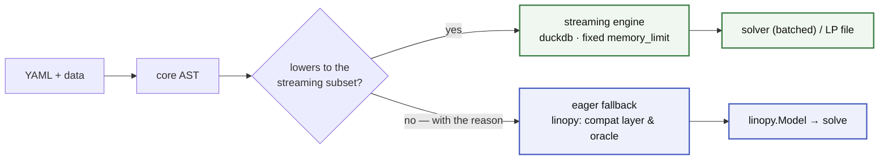

# linopy-yaml

Declarative optimisation: define the math in YAML, supply data at runtime, solve.

Models build on a **relational/streaming engine** (tidy tables in duckdb under a hard `memory_limit`, streamed straight to the solver — the full model never exists in process memory). [linopy](https://github.com/PyPSA/linopy) is kept in two roles: the **compatibility layer** — YAML extends Python-built `linopy.Model`s, and anything outside the streaming subset falls back to the eager linopy builder with a stated reason — and the **validation oracle** every language feature is differentially tested against.



## Goals

- **Declarative math** — defined in YAML, readable without knowing the implementation. Files are self-contained: no Python state changes what a file means.
- **Clean boundary** — YAML owns the math; Python owns data and solving.
- **Memory as a config knob** — build peak RAM is set by `memory_limit`, not by model size.
- **Fail early, fail loud** — everything validates at load time, with errors that name the problem and the fix.
- **A finite language, with a priced way out** — the expressive ceiling is a closure (affine, relational, local), not a feature race; where the math is genuinely unsayable, an `escape:` island runs Python on a declared slice, visible in the file and billed before it runs. What is in, what is out, and why: [ROADMAP.md](ROADMAP.md).

## Use cases

### 1. Author a full model in YAML

Small-to-medium models, teaching, policy studies, reproducible research.

```python
import linopy_yaml as ly

sol = ly.solve("dispatch.yaml", sources={...})
sol.objective
```

### 2. Add custom constraints to a Python-built model

Packages like PyPSA build their core math in Python, and their users modify it at runtime through **callbacks** (`extra_functionality`). Callbacks are maximally flexible — but the modification is invisible in the results, the math hides inside indexing/wiring code, and a Python function is not a sharable artefact. When the modification *is just math* (most policy requirements, pilot technologies, sensitivity scenarios), a YAML file fixes all three: it reads as the inequality itself, in the model's own vocabulary, and travels as a diffable text file. If you need arbitrary Python in the loop, stay with the callback.

```python
compat.extend(m, "ramp_constraint.yaml", data={"ramp_max": network.generators["ramp_max"]})
```

```yaml
# ramp_constraint.yaml
parameters:
  ramp_max: {dims: [generator]}
constraints:
  ramp_up:
    foreach: [snapshot, generator]
    where: "snapshot > 0 AND ramp_max"
    equations:
      - expression: p - roll(p, snapshot=1) <= ramp_max
```

### 3. Share and version-control model math as text

YAML diffs cleanly in review; colleagues without optimisation-Python experience can read and critique the math; research artefacts travel as files.

### 4. Build models that don't fit in memory

The streaming engine's home turf: a 107-million-variable dispatch model builds in ~0.6 GB. Expressions become tidy tables, masks become row absence, and the model streams to the solver in batches or to an LP file. There is no routing and no fallback: the streaming subset *is* the language, and a construct outside it is a load error naming its rewrite. See [ARCHITECTURE.md](ARCHITECTURE.md).

## Quick example

```yaml
# dispatch.yaml
dimensions:
  snapshot: {dtype: int}
  generator: {values: [wind, solar, gas]}
parameters:
  p_max: {dims: [generator]}
  load: {dims: [snapshot]}
  cost: {dims: [generator]}
variables:
  p:
    foreach: [snapshot, generator]
    where: "p_max > 0"
    bounds: {lower: 0, upper: p_max}
constraints:
  power_balance:
    foreach: [snapshot]
    equations:
      - expression: sum(p, over=generator) == load
objectives:
  total_cost:
    sense: minimize
    equations:
      - expression: sum(p * cost, over=generator)
```

```python
import linopy_yaml as ly
import pandas as pd

sol = ly.solve(
    "dispatch.yaml",
    sources={
        "p_max": pd.Series({"wind": 100, "solar": 60, "gas": 200}),
        "load":  pd.Series([80, 120, 150, 180, 140, 100], name="snapshot"),
        "cost":  pd.Series({"wind": 0, "solar": 0, "gas": 50}),
        "snapshot": pd.RangeIndex(6, name="snapshot"),
    },
)
sol.objective
```

## The language

YAML sections: `dimensions` · `parameters` · `variables` (incl. binary/integer) · `constraints` · `objectives` · `expressions` (named sub-expressions) · `macros` (parameterised templates) · `piecewise` (λ-formulation).

Expressions: arithmetic, comparisons, `where` masks, `sum` / `group_sum` / `roll` / `shift`. The helper set is closed — there is no Python registry, so both lanes accept the same language. Compositions go in `macros:`; math the language cannot say goes in a declared, budgeted `escape:` island.

[ARCHITECTURE.md](ARCHITECTURE.md) for how it fits together · [SPEC.md](SPEC.md) for the full specification.

## Installation

```bash
pip install "linopy-yaml[relational]"  # streaming engine (duckdb, highspy)
pip install linopy-yaml                # eager/compatibility layer only
```

## Non-goals

Not a solver wrapper, not a domain package, not a data-loading layer — bring pandas/xarray objects or parquet paths.

## Status

Pre-1.0 — early but moving fast. Both backends round-trip real models through solve with differentially verified results. Open questions live in [SPEC.md](SPEC.md) §11.

## License

MIT
