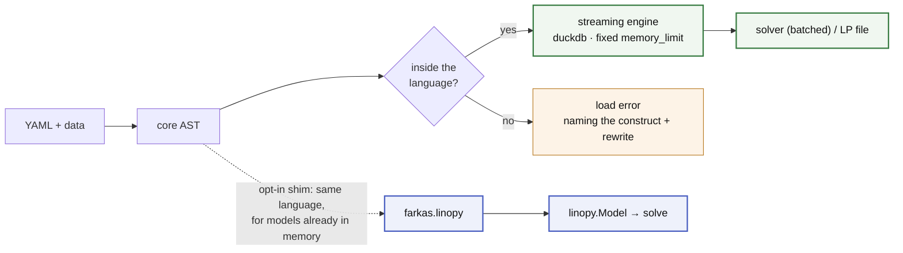

# farkas

**Self-documenting optimisation models — at any scale.**

Write the math in YAML, bind data at runtime, solve. Today that means linear and
mixed-integer programs. The model itself is never a Python object: it is tidy
tables in duckdb, built under a hard `memory_limit` and streamed straight into
the solver, so build peak RAM is set by a budget you choose rather than by the
size of the model. A 107-million-variable dispatch model builds in ~0.6 GB
([benchmarks](docs/benchmarks.md)).

And because the math is a closed spec known before any data is touched, every
name, dimension and expression is checked at load time — `check()` compiles a
whole model repository in CI with nothing bound to it at all.

> Named for [Farkas' lemma](https://en.wikipedia.org/wiki/Farkas%27_lemma): a
> system of linear inequalities either has a solution, or has a certificate that
> it has none — never both, never neither.



## Example

```yaml
# dispatch.yaml
dimensions:
  snapshot: {dtype: int}
  generator: {values: [wind, solar, gas]}
parameters:
  p_max: {dims: [generator]}
  load:  {dims: [snapshot]}
  cost:  {dims: [generator]}
variables:
  p:
    foreach: [snapshot, generator]
    where: "p_max > 0"
    bounds: {lower: 0, upper: p_max}
constraints:
  power_balance:
    foreach: [snapshot]
    equations:
      - expression: sum(p, over=generator) == load
objectives:
  total_cost:
    sense: minimize
    equations:
      - expression: p * cost
```

```python
import farkas as fk, pandas as pd

sources = {
    "p_max": pd.Series({"wind": 100.0, "solar": 60.0, "gas": 200.0}),
    "cost":  pd.Series({"wind": 1.0, "solar": 2.0, "gas": 50.0}),
    "load":  pd.Series([80, 120, 150, 180, 140, 100],
                       index=pd.RangeIndex(6, name="snapshot")),
}

# the model lives in duckdb, so the Result owns the executor that backs it
with fk.solve("dispatch.yaml", sources,
              coords={"snapshot": pd.RangeIndex(6, name="snapshot")},
              memory_limit="512MB") as result:
    print(result.objective)   # 1920.0
    print(result.primal("p"))
```

Sources can also be polars or pyarrow tables, or parquet paths — anything
exposing the Arrow PyCapsule protocol is accepted without conversion.

## Why

- **Declarative math** — readable without knowing the implementation, and
  self-contained: no Python state changes what a file means. It diffs cleanly in
  review and travels as a research artefact.
- **Memory as a config knob** — `memory_limit` is an invariant, not a hint. Masks
  are row absence rather than dense arrays, labels *are* the solver's own row and
  column indices, and no full-model object is ever resident in Python.
- **Fail early, fail loud** — every expression, `where` string and even *uncalled*
  macro template is parsed and name-checked before a single source is bound.
  Errors name the problem and its rewrite; nothing falls back silently.
- **A finite language with a priced way out** — the ceiling is a closure
  (affine ∩ relational ∩ local), not a feature race; genuinely unsayable math
  goes in an `escape:` island, visible in the file and billed before it runs.

The second use case is bolting YAML math onto a Python-built model. Packages
like PyPSA let users modify their core math through callbacks — maximally
flexible, but the modification is invisible in the results, the math hides
inside wiring code, and a Python function is not a sharable artefact. When the
modification *is just math*, a file fixes all three:

```python
from farkas import linopy as farkas_linopy

farkas_linopy.extend(m, "ramp.yaml", data={"ramp_max": network.generators["ramp_max"]})
```
```yaml
# ramp.yaml — `p` comes from the model; dims are declared here but their
# coordinates are inferred from it, so no `values:` is needed
dimensions: {snapshot: {dtype: int}, generator: {}}
parameters: {ramp_max: {dims: [generator]}}
constraints:
  ramp_up:
    foreach: [snapshot, generator]
    where: "snapshot > 0 AND ramp_max"
    equations:
      - expression: p - roll(p, snapshot=1) <= ramp_max
```

[linopy](https://github.com/PyPSA/linopy) is not a runtime dependency — that shim
is opt-in, and the same install doubles as the **oracle** every language feature
is differentially tested against. There is no routing and no fallback: both lanes
accept exactly the same language, and a construct outside it is a load error
naming its rewrite.

## Docs

[SPEC.md](SPEC.md) is the language reference · [ARCHITECTURE.md](ARCHITECTURE.md)
for how it fits together · [ROADMAP.md](ROADMAP.md) for what is planned and what
is refused.

To see it rather than read it, `python examples/walkthrough.py` runs one small model through every stage — YAML → schema → core AST → IR → duckdb tables → LP text → solution — printing the artifact each stage produces, plus two models the language refuses and why. Its output is committed as [examples/walkthrough.out](examples/walkthrough.out) if you would rather just read that.

```bash
pip install farkas            # the streaming engine (duckdb, highspy)
pip install "farkas[linopy]"  # adds linopy + xarray for the shim and oracle
```

Not a solver wrapper, not a domain package, not a data-loading layer — bring
pandas/xarray objects, Arrow tables, or parquet paths. MIT licensed.

## Status

Alpha, pre-1.0. **Breaking changes land without a deprecation cycle.** When a
construct is named wrong, a default is wrong, or a permissive input turns out
to hide a silent wrong answer, it gets fixed rather than aliased — carrying a
compatibility shim for every earlier spelling would defeat the point of a small
language.

In practice: pin an exact version if you depend on this, and read the
[CHANGELOG](CHANGELOG.md) before upgrading — breaking commits are marked `!`,
and every one names the rewrite. What exists is tested; both lanes round-trip
real models through solve, differentially verified against linopy. It is the
*surface* that is not yet frozen, not the behaviour.
