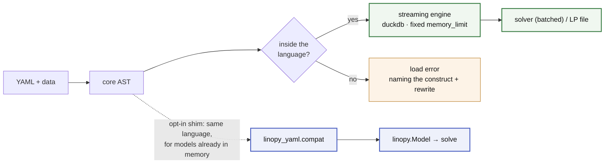

# linopy-yaml

Declarative optimisation: define the math in YAML, supply data at runtime, solve.

Models build on a **relational/streaming engine** — tidy tables in duckdb under
a hard `memory_limit`, streamed straight to the solver, so the full model never
exists in process memory. [linopy](https://github.com/PyPSA/linopy) is not a
runtime dependency; it is kept as an opt-in **compat shim** (YAML math onto a
`linopy.Model` already built in Python) and as the **oracle** every language
feature is differentially tested against. There is no routing and no fallback:
both lanes accept exactly the same language, and a construct outside it is a
load error naming its rewrite.



## Example

```yaml
# dispatch.yaml
dimensions:
  snapshot: {dtype: int}
  generator: {values: [wind, solar, gas]}
parameters:
  p_max: {dims: [generator]}
  load:  {dims: [snapshot]}
  cost:  {dims: [generator]}
variables:
  p:
    foreach: [snapshot, generator]
    where: "p_max > 0"
    bounds: {lower: 0, upper: p_max}
constraints:
  power_balance:
    foreach: [snapshot]
    equations:
      - expression: sum(p, over=generator) == load
objectives:
  total_cost:
    sense: minimize
    equations:
      - expression: p * cost
```

```python
import linopy_yaml as ly, pandas as pd

sources = {
    "p_max": pd.Series({"wind": 100.0, "solar": 60.0, "gas": 200.0}),
    "cost":  pd.Series({"wind": 1.0, "solar": 2.0, "gas": 50.0}),
    "load":  pd.Series([80, 120, 150, 180, 140, 100],
                       index=pd.RangeIndex(6, name="snapshot")),
}

# the model lives in duckdb, so the Solution owns the executor that backs it
with ly.solve("dispatch.yaml", sources,
              coords={"snapshot": pd.RangeIndex(6, name="snapshot")},
              memory_limit="512MB") as sol:
    print(sol.objective)   # 1920.0
    print(sol.primal("p"))
```

## Why

- **Declarative math** — readable without knowing the implementation, and
  self-contained: no Python state changes what a file means. It diffs cleanly in
  review and travels as a research artefact.
- **Memory as a config knob** — build peak RAM is set by `memory_limit`, not by
  model size; a 107-million-variable dispatch model builds in ~0.6 GB
  ([benchmarks](docs/benchmarks.md)).
- **Fail early, fail loud** — everything validates at load time, with errors
  naming the problem and the fix.
- **A finite language with a priced way out** — the ceiling is a closure
  (affine ∩ relational ∩ local), not a feature race; genuinely unsayable math
  goes in an `escape:` island, visible in the file and billed before it runs.

The second use case is bolting YAML math onto a Python-built model. Packages
like PyPSA let users modify their core math through callbacks — maximally
flexible, but the modification is invisible in the results, the math hides
inside wiring code, and a Python function is not a sharable artefact. When the
modification *is just math*, a file fixes all three:

```python
compat.extend(m, "ramp.yaml", data={"ramp_max": network.generators["ramp_max"]})
```
```yaml
# ramp.yaml — `p` comes from the model; dims are declared here but their
# coordinates are inferred from it, so no `values:` is needed
dimensions: {snapshot: {dtype: int}, generator: {}}
parameters: {ramp_max: {dims: [generator]}}
constraints:
  ramp_up:
    foreach: [snapshot, generator]
    where: "snapshot > 0 AND ramp_max"
    equations:
      - expression: p - roll(p, snapshot=1) <= ramp_max
```

## Docs

[SPEC.md](SPEC.md) is the language reference · [ARCHITECTURE.md](ARCHITECTURE.md)
for how it fits together · [ROADMAP.md](ROADMAP.md) for what is planned and what
is refused.

```bash
pip install linopy-yaml            # the streaming engine (duckdb, highspy)
pip install "linopy-yaml[compat]"  # adds linopy + xarray for the shim and oracle
```

Not a solver wrapper, not a domain package, not a data-loading layer — bring
pandas/xarray objects or parquet paths. Pre-1.0; both lanes round-trip real
models through solve with differentially verified results. MIT licensed.
