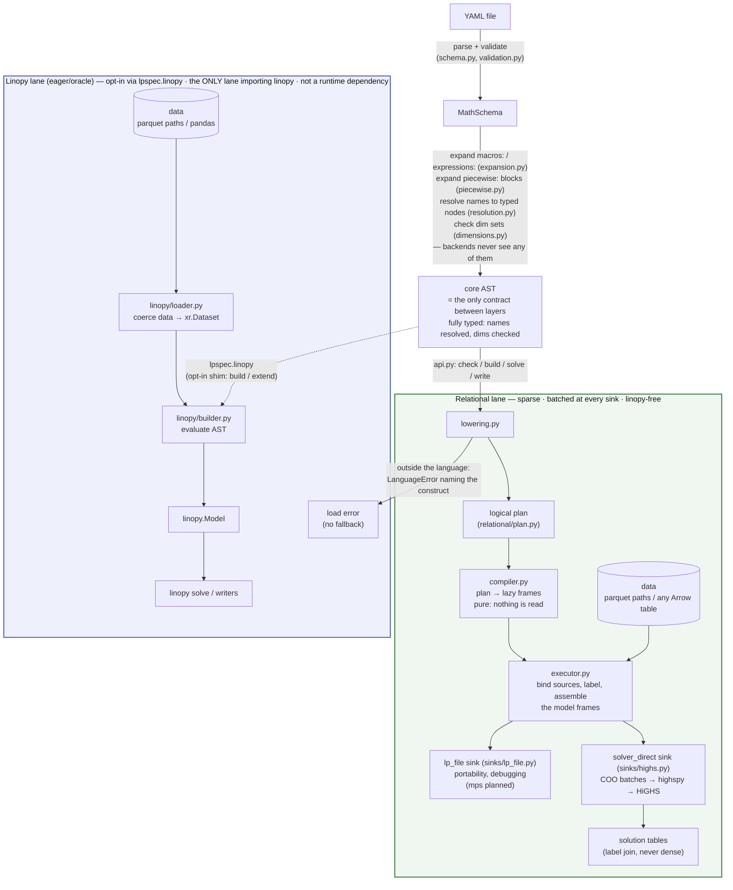
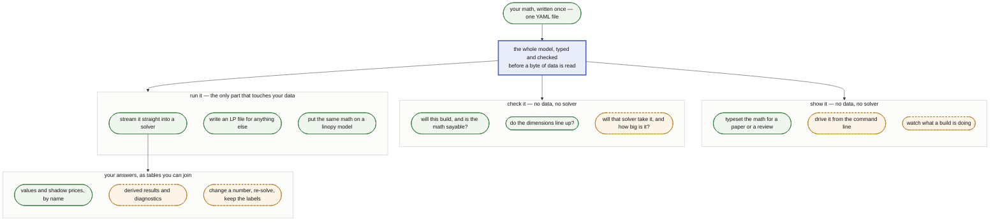

# Architecture

Brief, current, precise. A PR that changes the structure described here updates
this file in the same PR. The language is [docs/SPEC.md](SPEC.md); what may
enter it is [docs/design/ceiling.md](design/ceiling.md); plans and refusals
are [docs/ROADMAP.md](ROADMAP.md); measured results are
[docs/benchmarks.md](benchmarks.md), produced by the harness in
[bench/](https://github.com/FBumann/lpspec/blob/main/bench/README.md) — which is
also how a claim here gets falsified.

`python examples/walkthrough.py` executes the pipeline below stage by stage
and prints what each one produces — the same public calls `lps.solve` makes,
so the demonstration cannot drift from the code. Its output is committed as
[examples/walkthrough.out](https://github.com/FBumann/lpspec/blob/main/examples/walkthrough.out) and asserted line for line
(`tests/test_walkthrough.py`), so reading it is the same as running it — and a
stage that starts telling a different story shows up as a diff in that file.

## Thesis

A YAML math spec is a **closed AST known before any data is touched**. That one
property makes everything else legal: the whole model can be compiled — to eager
xarray/linopy calls, or to a logical plan executed relationally under a fixed
memory budget — with both paths provably meaning the same thing. Every rule
below protects it.

Eligibility is decided by **attempting the lowering** — `lower_program` returns
a `Program` or raises `lps.LanguageError` — so it cannot drift from what the
engine supports. Errors split model from run: everything under `LanguageError`
is decidable without data, `DataError` is what a source failed to supply, and
both are `LinopyYamlError` (`errors.py`). `lps.check()` is exactly parse
→ expand → validate → lower with no data bound, so a model repository can
compile-check its math in CI. Expansion precedes validation in **both** lanes,
because a formulation emits declarations and those are language too — a stray
dim in generated math is the same error as a stray dim in a written one.

## One contract, many consumers

The AST is a **narrow waist**. Everything upstream emits it, everything
downstream reads it, and nothing else has to agree on anything — so the model
you write once is the same model that gets checked, solved, typeset and read
back.

**Solid is what ships today; dashed is what the shape makes cheap.** None of the
dashed boxes is a rewrite — each reads the same AST the engine reads, so a
renderer is a tree walk, a check is a pass with no data bound, and a new output
format is one function in `relational/sinks/`. `latex.py` is that claim cashed:
a **spike** that typesets any model the lanes can build, in one walk of the
resolved AST, holding no opinion the lanes do not already hold — including a
`piecewise:` block, which prints as the λ-formulation it expands to rather than
as the sugar it was written as. How names *print* is the one thing it does not
read off the model: a symbol table is presentation, so it is a sidecar file
(`examples/symbols/`) rather than keys on `MathSchema`, and a model with no
table still renders. It splits the way `relational/sinks/` does — one walk over
the AST, one module per output format — so a format is a spelling table rather
than a second walk that could disagree about what the model says. Two properties carry it: **data
enters at exactly one place**, which is why checking a model costs seconds and
needs nothing but the file; and the waist is **closed**, which is what the
ceiling in [docs/design/ceiling.md](design/ceiling.md) protects — a new consumer
is free, a new primitive is taxed. What is planned, and why, is
[docs/ROADMAP.md](ROADMAP.md).

## Hard rules

*Enforced, not aspirational: `tests/test_architecture.py` encodes these as
static checks and CI's bare-install job proves the dependency claims.*

**These rules constrain the language.** What a construct may say, which layer
may know what, and what a file means on its own — each survives any engine, and
each decides what can enter `docs/SPEC.md`. How much a build *costs* is a property of
the engine, measured in [docs/benchmarks.md](benchmarks.md) and not a rule.
It was one once, phrased around a `memory_limit` that only one engine had, and
that made an implementation choice load-bearing in the language's rulebook.

0. **The layers are ordered, and imports prove it.** Every module imports only
   downward, at module level, with exactly one declared exception: `lowering.py`
   reaches `piecewise.py` lazily, because a formulation must expand *before*
   lowering while expanding needs the subset test lowering defines.
   `DELIBERATE_LAZY_IMPORTS` in `tests/test_architecture.py` is the whole list,
   and an undeclared in-function import fails the build — a lazy import is how
   the one real cycle is broken, so decorative ones cannot be allowed to hide
   it.
1. **Core AST is the whole language.** Both backends consume only core AST;
   macros, named expressions and `piecewise:` are expanded away before dispatch,
   and the plan/query/xarray are backend-private. The AST crossing that seam is **fully
   resolved** — names are typed `Variable`/`Parameter`/`Dimension` nodes — so a backend cannot
   hold its own opinion about what a name refers to. Resolving independently is
   how the two lanes silently disagreed about scoping before.
2. **The engine knows nothing about linopy, xarray or YAML.**
   `src/lpspec/relational/` goes polars → highspy → solver, with linopy's
   semantics as a spec to match rather than code to share; it never sees the
   schema, the AST, or the eager builder. Engine-internal naming encodes
   neither "polars" nor "yaml". Enforced *more* strictly than stated — the
   engine imports nothing from the package at all, bar declared
   dependency-free leaves (`errors.py` today, listed in `ENGINE_MAY_IMPORT`)
   — because a near-zero import surface is what keeps the subpackage
   extractable. Widening that list is a decision, not an accident.
3. **One language, two lanes — not fast-vs-slow versions of each other.** The
   streaming engine builds models declared in YAML; the linopy lane attaches
   YAML math to a `linopy.Model` already in memory, which is structurally eager.
   **Both accept exactly the same language**, and no helper registry exists that
   could create a divergence — that equality is what makes the differential
   tests an oracle rather than a comparison of dialects. A construct outside the
   language is a load error naming the construct and its rewrite, never a
   redirection to the other lane.
4. **Backend-visible YAML files are self-contained.** No Python-side state
   (registries, session objects) may change what a file means.
5. **The public interface is a declared model, not a Python API.** YAML is the
   format we ship and document; the contract underneath it is `MathSchema`, and
   whether that seam is ever blessed is open (see
   [Composition](design/ceiling.md#composition-component-libraries)). The Python
   surface is the runner (`api.py`); the plan is internal, and a stable
   plan-construction API is a later possibility, not a current contract.

## The relational lane

**Three modules, one per box above.** `compiler.py` turns plan nodes into lazy
frames and reads nothing; `executor.py` binds the data and fills the model
frames; `sinks/` drains them. The split is what makes the admissibility test
below something you can perform rather than reason about — build a
`PolarsCompiler`, hand it a node, read `.explain()` (`tests/test_compiler.py`
does exactly that, over empty frames: a schema is all it takes to compile a
query). It is also why a new sink is a function in one file instead of another
method on the executor.

**Tidy tables.** Parameters are `(dims…, value)`; a variable frame is
`(dims…, var_label)`, one row per *existing* variable; a linear expression is
`(frame dims…, var_label, coeff)` plus a constant part; constraint rows are
`(row, sense, rhs)`; the coefficient matrix is COO `(row, col, coeff)`. Masks
are **row absence** — no NaN sentinels, no `-1` labels. Broadcasting is a join,
`sum` drops coordinate columns, `group_sum` joins the dim table and projects a
declared coordinate in place of the grouped dim. Neither aggregates: both
rewrite a fragment's dim tuple, and duplicates collapse in the terminal
`SUM(coeff) GROUP BY row, col` at assembly. Labels
are dense `0..n-1` by construction, so `var_label` **is** the solver column
index and `row` the solver row index — no remapping. That is also why value-only
re-solve is cheap and structural editing is out of scope.

Labels are also **row-major over the coordinate product**, and that is a
contract rather than a side effect of how they are computed: it is what makes a
build reproducible run to run. `_label_frame` reaches it three ways depending on
how much of the product survives the mask — arithmetic, factored, counted — and
they must agree integer for integer, because a label *is* a solver index.

**The plan is affine-by-design.** No node introduces variables or constraints as a
side effect of an expression; formulations are model *transformations*. Variable
*types* are not formulations — binary/integer are a `vtype` column, LP
`binary`/`general` sections and HiGHS integrality, which keeps basic MILP inside
the streaming lane. Reimplementing linopy's reformulation passes inside the plan
is explicitly rejected: that duplicates the library this package consumes.

**Labels are the one place order is load-bearing.** `var_label` is the solver's
column index and `row` is its row index, so both are assigned by sorting the
masked coordinate product on its dimensions' declared ordinals and numbering
the result. Variables and constraint rows are the same operation over different
frames and it is written once (`_label_frame`) — twice is how the two would
come to disagree about which coordinate gets which index. Everything else
is order-free, which is what lets the query planner rearrange it.

That order is also what comes **back**. `primal` / `dual` / `to_parquet` sort on
the label before handing rows over, so a read is row-major over the coordinate
product — the same order the LP sink writes. Sorting is stated at the read
rather than assumed from the inputs, because a `where` mask decides which rows
of the product survive and a join decides nothing about the order they arrive
in; without it two reads of one unchanged result came back differently.

**A frame is the boundary in both directions.** `relational/frames.py`
recognises a caller's table through the Arrow PyCapsule protocol without
importing any dataframe library, and `Result.primal` hands back a
`polars.DataFrame`, which exports the same protocol. That symmetry is what
keeps pandas and pyarrow off the dependency list: they are bridges *out*
(`to_pandas`, `to_dataarray`), shipped with the `[linopy]` extra, not shapes
the engine holds. The bare-install CI job runs the suite with neither present.

**Sinks are capped, explicitly.** Today every sink expresses the same three
streams and no more: `cols` (bounds, objective coefficients, integrality),
`rows`, and `A` in COO. The upgrade path is two further streams — `sos_sets`
and `genconstr` — plus a semi-continuous threshold on `cols`. Unlike the three
that exist, those two would land *unevenly*, because the destinations differ
per sink (see "Capability is not the ceiling"); that unevenness is what
[Track 4](ROADMAP.md#track-4--sink-capabilities) exists to make declared rather
than discovered at solve time.

## Module map

| Module | Role |
|---|---|
| `schema.py` | pydantic schema incl. `expressions:` / `macros:` / `piecewise:` |
| `expression_parser.py`, `where_parser.py` | text → core AST; grammar only, dependency-free |
| `expansion.py` | named-expression / macro substitution (pre-dispatch) |
| `resolution.py` | one flat namespace; `NameNode` → typed `Variable`/`Parameter`/`Dimension` nodes |
| `dimensions.py` | static dim-set checking over the resolved AST |
| `validation.py` | load-time: parse, expand, resolve, check everything |
| `piecewise.py` | `piecewise:` → λ-formulation declarations + curvature guard |
| `api.py` | native entry point: `check` / `solve` / `write`, linopy-free |
| `typeset/` | **spike** — resolved AST → LaTeX / Typst. A reader, not a lane: no model, no data, no plan ([README](https://github.com/FBumann/lpspec/blob/main/src/lpspec/typeset/README.md)) |
| `sources.py` | bind runtime data (parquet paths / in-memory tables) to a validated schema |
| `lowering.py` | core AST → logical plan (defines the relational subset) |
| `helpers.py` | the closed set of built-in operators: their *names* and *call shapes* — no registry |
| `errors.py` | the exception hierarchy; the one module the engine may import |
| `relational/plan.py` | frozen logical-plan dataclasses |
| `relational/frames.py` | the boundary — caller tables in, via the Arrow PyCapsule protocol |
| `relational/compiler.py` | plan → lazy frames; pure, reads nothing |
| `relational/chunking.py` | how a batched pass sizes its chunk: budget ÷ the width of one unit |
| `relational/status.py` | solve outcome on two axes; linopy's vocabulary, copied not imported |
| `relational/executor.py` | bind sources, assign labels, assemble the model frames |
| `relational/data_validation.py` | is the bound data usable — one row per coordinate, labels that exist, single-valued coords |
| `relational/sinks/` | how a built model leaves: `lp_file`, `solver_direct` (one module each, [README](https://github.com/FBumann/lpspec/blob/main/src/lpspec/relational/sinks/README.md)) |
| `linopy/__init__.py` | opt-in shim: `build` / `extend` on a `linopy.Model` |
| `linopy/loader.py` | data coercion to `xr.Dataset`, master coords |
| `linopy/builder.py` | eager backend: core AST → `linopy.Model` |
| `linopy/semantics.py` | where this lane answers linopy's v1 arithmetic convention — one home, as linopy's own `semantics.py` is |

Two subpackages, and the directory *is* the rule in both cases. Everything
under `relational/` is the engine and imports nothing else from the package;
everything under `linopy/` is the opt-in eager lane and is the only code
allowed to import linopy or xarray; everything under `typeset/` reads the AST
and writes text, and reaches neither the plan nor any data. `tests/test_architecture.py` reads
membership off the path, so neither fence can be stepped over by naming a
file differently.

### Naming across the layers

The same construct passes through three layers, and each names it in full —
no abbreviations, so a name never has to be decoded. The **layer is the
suffix**, which is what keeps the three vocabularies from colliding:

| Layer | Suffix | Example |
|---|---|---|
| YAML block (`schema.py`) | `Block` | `VariableBlock`, `PiecewiseBlock` |
| Core AST (`*_parser.py`) | `Node` | `VariableNode`, `DimensionComparisonNode` |
| Logical plan (`relational/plan.py`) | none / `Declaration` | `Variable`, `VariableDeclaration` |

Two rules follow from that table, and a PR that adds a construct keeps them:

- **A node names the coordinate map, not a surface spelling.** `roll` and
  `shift` are one node, so it is `Translate` — naming it `Shift` would make
  one of the two spellings look privileged.
- **Nothing is abbreviated.** `Cmp` became `ParameterComparison`, `vtype`
  became `variable_type`. The one place abbreviation survives is frame column
  names inside the engine, which are not Python identifiers.

### Where a concept is already linopy's, use linopy's name

For anything this package shares with linopy — solve statuses, result shapes,
solver metrics, duals — adopt **linopy's primitive**: its spelling, its field
names, its decomposition. `Result` is the envelope (status + solution +
report) and `Solution` the raw arrays, because that is what those words mean
in linopy; `status` / `termination_condition` are two axes and `is_ok` is the
rollup, because that is linopy's model. Our audience arrives from
linopy/PyPSA, and a second vocabulary for one fact is a tax on every one of
them. It also keeps the oracle honest: the two lanes can be compared exactly
rather than through case-folding.

**Copy it; do not import it.** The engine may not import linopy (rule 2), so
the tables live here — and a test imports linopy and asserts the copy still
matches (`tests/test_solve_status.py`). A copy nobody checks is a copy that
rots, and the failure should be a red test rather than a user handed two
dialects.

This applies to vocabulary we *share*. Where the design genuinely differs it
stays ours: we have no `Solution` of dense arrays to hold, because the values
are read back by joining labels to coordinates.

## Extension checklists

**Add a macro or named expression:** edit YAML. Nothing else.

**Add a primitive:** grammar (usually free — `f(x, k=v)` already parses) →
signature in `helpers.BUILTINS` (arity and which arguments name dimensions —
resolution, validation and lowering all read it from there, so the shape is
declared once) → eager helper → plan node + locality class → executor →
lowering case → differential test on both sinks → SPEC §5/§7, and this file if
structural.

Two things are deliberately *not* per-primitive work, because they are one
implementation each: a primitive's dim rule lives only in `dimensions.py` —
both its dim *set* and its verdict on an operand that lacks the dim being
reduced along, which lowering asks for rather than deciding again — and the
dense-label assignment that gives a coordinate its solver index lives only in
`PolarsExecutor._label_frame`, shared by variables and constraint rows. What a
lowering case still owns is what is about the plan: which node the call becomes,
and the shapes that node cannot represent.
