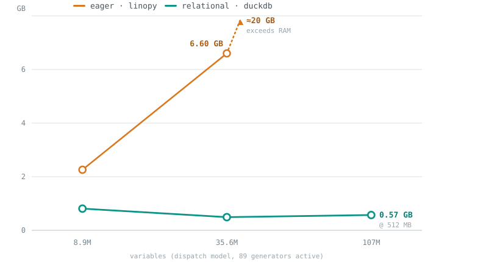

# Measured results: streaming vs eager LP construction

Evidence for the central claim — build peak RSS is a config knob
(`memory_limit`), not O(dense dim product) — and for where that claim currently
stops holding.

Everything under [Results](#results) is produced by [`bench/`](../bench/README.md)
and read straight off [`bench/results/latest.jsonl`](../bench/results/latest.jsonl),
which carries the machine fingerprint and library versions that produced it:

```bash
uv run python -m bench.run --sizes all --repeat 2 --memory-limits 256MB 1GB 4GB
uv run python -m bench.report bench/results/latest.jsonl
```

Both arms build the *same* YAML through the two lanes and write an LP file —
farkas via `fk.build` + `write_lp`, linopy via `Model.to_file(io_api='lp-polars')`
— so the only difference is the engine. Before anything is timed, the smallest
rung of each case is solved on both arms and the objectives compared; the run
aborts on a mismatch, because a perf number describing two different models is
worse than no number. Peak RSS is `ru_maxrss`, the counter `/usr/bin/time -l`
reports, one process per measurement.

## Results

macOS 26.2, M-series, 24 GB RAM · python 3.13.2 · farkas 0.0.0a13, linopy 0.9.0,
duckdb 1.5.5, polars 1.43.0, xarray 2026.7.0. Parity gate: all three cases agree
to 0 relative (bit-identical objectives). Best of two repeats; wall time excludes
import and includes teardown. `live` is the fraction of the coordinate product
that survived the model's `where` — measured, not assumed.

### dispatch — pointwise bounds + one `sum` per row

| variables | live | rows | wall: farkas | wall: linopy | wall | peak: farkas | peak: linopy | peak | LP | scratch |
|---|---|---|---|---|---|---|---|---|---|---|
| 10k | 100% | 100 | 0.06 s | 0.19 s | 0.29x | 0.16 GB | 0.21 GB | 0.73x | 1 MB | 0.00 GB |
| 100k | 100% | 1k | 0.18 s | 0.21 s | 0.86x | 0.18 GB | 0.26 GB | 0.69x | 7 MB | 0.01 GB |
| 1M | 100% | 10k | 0.71 s | 0.35 s | 2.06x | 0.40 GB | 0.58 GB | 0.69x | 74 MB | 0.02 GB |
| 10M | 100% | 100k | 5.84 s | 1.98 s | 2.96x | 0.88 GB | 2.24 GB | **0.39x** | 768 MB | 0.22 GB |

### nodal — a technology portfolio per node

Dispatch over `(snapshot, node, tech)` where a technology only generates at a
node it is installed at. 50 nodes x 12 technologies is 600 coordinates per
snapshot; 3 per node exist. This is the sparsity every real multi-node model
has, and it is structural — `installed` carries node and tech, never snapshot.

| variables | live | rows | wall: farkas | wall: linopy | wall | peak: farkas | peak: linopy | peak | LP | scratch |
|---|---|---|---|---|---|---|---|---|---|---|
| 3k | 25% | 1k | 0.05 s | 0.20 s | 0.25x | 0.16 GB | 0.21 GB | 0.76x | 0 MB | 0.00 GB |
| 30k | 25% | 10k | 0.11 s | 0.20 s | 0.52x | 0.17 GB | 0.24 GB | 0.71x | 2 MB | 0.00 GB |
| 300k | 25% | 100k | 0.46 s | 0.27 s | 1.73x | 0.25 GB | 0.45 GB | 0.55x | 25 MB | 0.01 GB |
| 3M | 25% | 1M | 3.48 s | 0.94 s | 3.69x | 0.58 GB | 1.55 GB | **0.38x** | 257 MB | 0.09 GB |

### transport — three `group_sum` joins per row

| variables | live | rows | wall: farkas | wall: linopy | wall | peak: farkas | peak: linopy | peak | LP | scratch |
|---|---|---|---|---|---|---|---|---|---|---|
| 9.8k | 100% | 1.4k | 0.07 s | 0.25 s | 0.29x | 0.17 GB | 0.22 GB | 0.76x | 1 MB | 0.00 GB |
| 98k | 100% | 14k | 0.24 s | 0.26 s | 0.94x | 0.20 GB | 0.29 GB | 0.71x | 7 MB | 0.01 GB |
| 980k | 100% | 140k | 0.93 s | 0.44 s | 2.12x | 0.40 GB | 0.66 GB | 0.61x | 76 MB | 0.02 GB |
| 9.8M | 100% | 1.4M | 7.74 s | 2.68 s | 2.89x | 1.35 GB | 1.89 GB | 0.71x | 794 MB | 0.25 GB |

### The mask sweep

`nodal` at one model size (1.2M nominal), varying only how many of the 12
technologies each node has installed: 12 / 6 / 3 / 1.

| live | variables | wall: farkas | wall: linopy | wall | peak: farkas | peak: linopy | peak |
|---|---|---|---|---|---|---|---|
| 100% | 1.2M | 1.22 s | 0.39 s | 3.10x | 0.48 GB | 0.63 GB | 0.77x |
| 50% | 600k | 0.73 s | 0.32 s | 2.28x | 0.35 GB | 0.60 GB | 0.58x |
| 25% | 300k | 0.44 s | 0.28 s | 1.56x | 0.25 GB | 0.45 GB | 0.55x |
| 8% | 100k | 0.30 s | 0.24 s | **1.25x** | 0.20 GB | 0.35 GB | 0.59x |

### Peak RSS against the budget

farkas at three `memory_limit` settings, 16x apart end to end:

| case | variables | `256MB` | `1GB` | `4GB` | linopy |
|---|---|---|---|---|---|
| dispatch | 1M | 0.38 GB | 0.40 GB | 0.40 GB | 0.58 GB |
| dispatch | 10M | 0.76 GB | 0.88 GB | 0.92 GB | 2.24 GB |
| nodal | 300k | 0.26 GB | 0.25 GB | 0.25 GB | 0.45 GB |
| nodal | 3M | 0.69 GB | 0.58 GB | 0.59 GB | 1.55 GB |
| transport | 980k | 0.39 GB | 0.40 GB | 0.40 GB | 0.66 GB |
| transport | 9.8M | **OOM** | 1.35 GB | 1.35 GB | 1.89 GB |

## What the numbers say

**Sparsity is where the gap closes, and real models are sparse.** On the mask
sweep, farkas costs what survives while the eager lane costs the product: from
12 technologies per node down to 1, our wall time falls 4x (1.22 -> 0.30 s) and
linopy's falls 1.6x (0.39 -> 0.24 s), so the ratio goes 3.10x -> 1.25x. Peak
follows the same way, 0.77x -> 0.59x. `docs/benchmarks.md` used to list this
sweep under "not measured yet" and predicted the difference would be
*"qualitative rather than 2x"*. It is qualitative — the two lanes scale on
different quantities — though at the densities real portfolios have it shows up
as a factor rather than an order.

**The memory win is decisive at scale and best where the model is sparse.**
0.39x on `dispatch` at 10M and 0.38x on `nodal` at 3M live variables, against
~0.75x at the small end where a fixed ~0.16 GB import floor dominates.

**Build is ~2-3x slower above ~10⁶ variables, and faster below ~10⁵.** The
crossover is linopy's fixed overhead rather than anything about the engines.
This is the honest headline: the trade is memory for wall time, and the price
went *up* when the harness was made fair — see below.

**Peak does not track the budget.** Across a 16x range of `memory_limit`, peak
at 10M variables moves 0.76 -> 0.92 GB — under 20%, and 2-3x the budget itself.
Hard rule 4 is supported in its *comparative* form (peak is far below the eager
lane and the gap widens with model size) and not in its literal one.

**One shape still OOMs instead of spilling.** `transport` at 9.8M variables
under 256 MB dies in the terminal `SUM(coeff) GROUP BY row, col`
(`executor.py::_build_constraint`), where a comment asserts that plain hash
aggregates spill on their own. `dispatch` at 10M and `nodal` at 3M are fine, so
the trigger is the `group_sum` join fan-in, not scale.

**The engine also spends disk.** The `scratch` column is the duckdb working
database at the end of emit — 0.25 GB at 9.8M variables. Small beside the LP
file it is writing, but it is a cost the peak-RSS number does not show, so the
harness records it.

### The numbers got worse when the harness got fairer

`dispatch` at 10M went from 2.09x to 2.96x between the first ladder and this
one, and almost none of that is the engine. linopy's `to_file` defaults
`progress` to `m._xCounter > 10_000`, so every rung above the smallest had been
rendering tqdm progress bars that the farkas arm has no equivalent of; the
harness now passes `progress=False`. In the other direction, farkas is now
charged for `ex.close()` — releasing the scratch database — which it previously
got for free. Both changes move against us. The boundaries are documented in
[bench/README.md](../bench/README.md#where-the-clock-starts-and-stops); the rule
is that a phase counts only if both arms could pay it.

## Earlier numbers, not reproducible

These came from a harness under `scratch/` that has since been removed. They are
kept because the 107M-variable run is a capability proof nothing above replaces —
a model whose dense build does not fit on the machine at all — and because the
runtime attribution still holds. They cannot be re-run: different model sizes,
different code.



| model | backend | budget | peak RSS | wall | LP size |
|---|---|---|---|---|---|
| S=100k (8.9M vars) | linopy lp-polars | — | 2.26 GB | 1.6–1.9 s | 555 MB |
| S=100k | duckdb | 1 GB / chunk 25k | 0.81 GB | 3.1 s | 637 MB |
| S=400k (35.6M vars) | linopy lp-polars | — | 6.60 GB | 7.8 s | 2.31 GB |
| S=400k | duckdb | 512 MB / chunk 25k | **0.49 GB** | 14.5 s | 2.64 GB |
| S=1.2M (107M vars) | linopy lp-polars | — | ~20 GB extrapolated — exceeds this machine | — | — |
| S=1.2M | duckdb | 512 MB / chunk 25k | 0.57 GB | 74 s | 7.99 GB |

Runtime there was dominated by fixed work — re-scanning the vars table per
section, ~100M `printf` calls, a 2.6 GB CSV write — not by spilling, which is why
a bigger budget did not help. End-to-end `solver_direct` (batched HiGHS
`addCols`/`addRows`, no LP file) at 35.6M variables: solve 30.5 s, Optimal,
objective identical to the oracle; process peak 5.76 GB dominated by HiGHS's own
model and simplex workspace, the residency hard rule 4 exempts.

## Not measured yet

In rough order of what would change a decision: `solver_direct` end-to-end (the
shipped path, where the LP file is not written at all); `storage` (`roll`, the
bounded-halo self-join); a MILP, where solve time dwarfs build; a `where`-density
sweep, since masks are row absence here and NaN-dense in xarray — the one axis
where the gap should be qualitative rather than 2×; and a hand-written
highspy/CSR arm as the speed-of-light floor, without which "2× slower than
linopy" has no denominator.

## Operational findings

Load-bearing for `relational/executor.py`; its module docstring states the
resulting rules and this is the evidence behind them.

1. **Not every relational operator spills.** duckdb raises OOM rather than
   exceed `memory_limit` when the plan needs an unspillable operator:
   `string_agg(... ORDER BY ...)` buffers everything (plain `string_agg` is
   fine at moderate group counts); a global-`ORDER BY` window (`ROW_NUMBER` for
   labels) materialises its whole input and OOMs at ~35M rows under tight
   budgets; even a plain external-sort rewrite of the constraint section OOMs
   below ~1 GB at 9.3M rows.
2. **Partition-wise execution is the fix.** Chunking by the leading foreach dim
   bounds every operator: labels = per-chunk `ROW_NUMBER` + running offset;
   constraint blocks = per-chunk `GROUP BY` + `COPY`, parts concatenated. Chunk
   size and memory limit trade off directly; 25k snapshots fits in 256 MB.
3. **LP section order is free.** Line order inside sections is irrelevant to
   solvers (labels live in the text), so no global sorts are needed — hence
   `SET preserve_insertion_order=false`.
4. **Measurement pitfalls.** memray's tracker slows duckdb ~8× (allocation
   interception on a multithreaded, allocation-heavy engine) while barely
   affecting linopy — never benchmark *runtime* under memray, and its allocator
   peak overcounts polars (reserved arenas). Use untracked `/usr/bin/time -l`
   peak RSS as the gate metric; memray for attribution only.
5. **A file-backed duckdb database** (not `:memory:`) is required for the buffer
   pool to spill table data under `memory_limit`.
6. **Constraint assembly is a counter-example to finding 1's exception list.**
   `_build_constraint` runs one unchunked
   `INSERT INTO A … SELECT row, col, SUM(coeff) … GROUP BY row, col`, on the
   stated grounds that joins and plain numeric hash aggregates spill on their
   own. `transport` at 9.8M variables under a 256 MB budget raises
   `OutOfMemoryException` there; `dispatch` at 10M does not. The difference is
   the `group_sum` join fan-in — three joined term streams unioned into one
   aggregate — so the rule wants narrowing to "spills, unless the fan-in is
   wide", and the fix is the same partition-wise treatment finding 2 describes.

## Sink capabilities

What each sink can ingest, measured against the shipped solvers rather than
assumed. The architectural reading is in
[ARCHITECTURE.md](../ARCHITECTURE.md#capability-is-not-the-ceiling); the plan is
[ROADMAP Track 4](../ROADMAP.md#track-4--sink-capabilities).

| | `lp_file` | HiGHS direct | Gurobi direct |
|---|---|---|---|
| affine rows, COO, integrality | text | native | native |
| semi-continuous | text | `kSemiContinuous` | native |
| SOS1 / SOS2 | text section | **no concept** — `HighsLp` has no SOS field, no `addSos` | `addSOS` |
| indicator | text section | **no concept** | `addGenConstrIndicator` |
| quadratic objective | text section | `passHessian` — but `Hessian + integrality` returns `kError`, so no MIQP | native, incl. MIQP |

HiGHS results are measured here; Gurobi's are from the API and linopy's
`SolverFeature` table, and want a spike before they are relied on. linopy
declares HiGHS with `INTEGER_VARIABLES` *and* `QUADRATIC_OBJECTIVE` in one flat
`frozenset`, so its own model reports MIQP as available — the conjunction is
what a capability descriptor has to express.

### The quadratic handoff

Neither direct API has an incremental counterpart to batched
`addCols`/`addRows`: `passHessian` and `setMObjective` take the quadratic part
whole. Under the aligned-only scope (`variable × variable` at the same
coordinates) `Q` is **diagonal**, so it costs 16 bytes per quadratic column:

| quadratic cols | diagonal Hessian |
|---|---|
| 10⁷ | 0.16 GB |
| 3.56×10⁷ | 0.57 GB |
| 10⁸ | 1.60 GB |

Against the measured `solver_direct` peak of 5.76 GB at 35.6M variables —
already dominated by HiGHS's own model, which hard rule 4 exempts — 0.57 GB is
~10%. On `lp_file`, where nothing is exempt, a quadratic objective is a text
section and streams like any other. So this is a cost, not an invariant
violation. Two caveats:

- HiGHS accepts `dim_ < num_col` (verified), so ordering quadratic variables
  first bounds the Hessian to that block rather than the whole model.
- **The diagonal argument dies with the aligned restriction.** General bilinear
  `Q` is not diagonal, and then peak stops tracking the budget — a second,
  independent reason that restriction is load-bearing.
